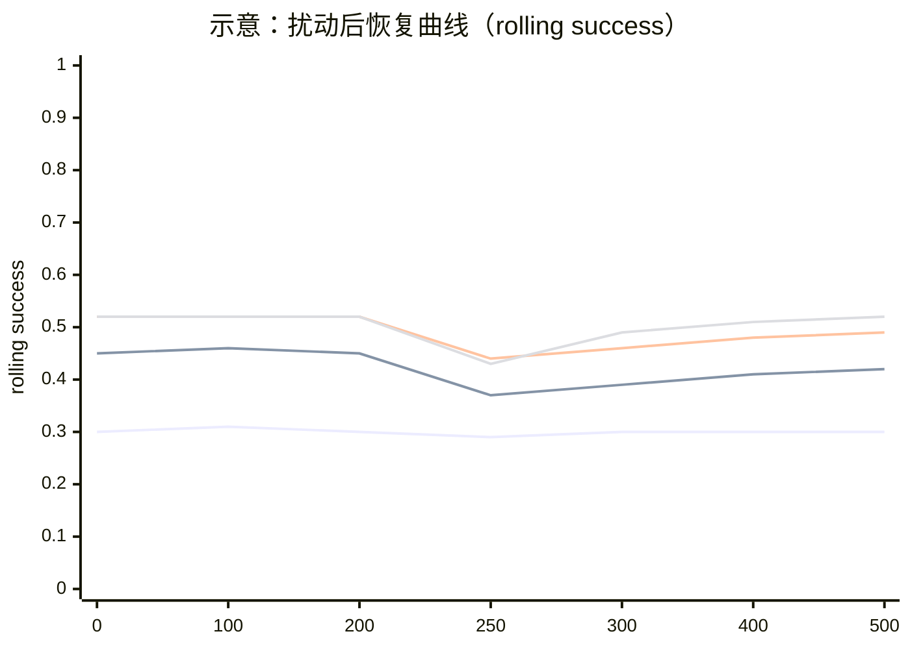

# 动态 LLM 智能体系统中的能力感知路由学习：NeurIPS 导向的 Related Work 定位、必要性论证与可复现对比实验 Protocol

## 执行摘要

你提供的扩展摘要提出“**动态 worker 池**下的能力感知协同调度”问题：任务分布相对稳定，但可调用的 worker（不同模型/工具权限/成本/时延/版本）随时间变化，控制器必须在**能力边界不可直接观测**的条件下，通过执行反馈在线推断各 worker 的多维能力画像，并据此做路由与轻量分解—路由决策。核心方法是维护可在线更新的**多维能力嵌入**（适配性、成功率、token 成本、时延、稳定性等），构成“任务编码→能力估计→路由/轻量分解→执行→后验更新”的闭环；目标是在成功率—成本—时延—协同开销之间做可学习的多目标权衡。相较现有路由/级联多面向静态候选集合与离线训练（RouteLLM、FrugalGPT、LLM Cascades），以及多智能体框架偏工作流/提示工程（AutoGen、CAMEL），本工作将“**替换/漂移/冷启动**”与“**扰动后恢复速度**”提升为核心评测对象，具有更贴近部署的研究张力；实验上，建议优先以 GSM8K + HumanEval（可自动判分）构造 T=500 任务流，并通过 OpenRouter 4-worker 池跑出恢复曲线与成本—质量 Pareto，作为 NeurIPS 风格“可证伪”的强首轮证据。citeturn3search0turn3search1turn14search5turn17search0turn13search0

```mermaid
flowchart LR
  A[输入任务 x_t] --> B[任务编码 z(x_t)]
  B --> C[能力模块: 为每个worker维护多维能力嵌入 ĉ_i]
  C --> D{决策动作}
  D -->|直接路由| E[选1个worker执行]
  D -->|少量并行| F[选k个worker并行/投票]
  D -->|轻量分解→再路由| G[先生成计划/子任务]
  G --> E
  E --> H[执行反馈: success, token, latency, cost]
  F --> H
  H --> I[在线更新: ĉ_i 与路由器参数]
  I --> C
```

## 摘要要点提取表

> 说明：以下抽取自你上传的扩展摘要文件（/mnt/data/能力感知路由学习.md）。摘要未给出者标注为“未指定”。

| 维度 | 从扩展摘要抽取/归纳的内容 |
|---|---|
| 研究问题 | 在层级式多智能体 LLM 系统中，当**任务分布相对稳定**但**worker 池动态变化**（模型家族/工具权限/成本/时延/版本漂移）时，主调度器如何在 worker 能力边界不可直接观测条件下，通过执行反馈持续推断能力并进行协同调度（任务路由与轻量分解—路由），在成功率与资源开销间取得最优权衡。 |
| 核心方法 | 维护每个 worker 的**多维能力嵌入**（任务适配性、预期正确性/成功率、token 成本、时延、稳定性等），基于任务编码与能力嵌入预测“任务—worker 适配度/效用”，并在小规模动作空间（直接路由/少量并行/轻量分解后路由）中选择动作；执行后用反馈在线更新能力后验，形成闭环学习。 |
| 关键假设 | 任务族相对稳定；worker 池非平稳（替换、漂移、冷启动、成本/时延变化）；可获得执行反馈但观测**部分且滞后**；“轻量分解”被约束为少量子任务以隔离“能力估计→调度”贡献（不追求任意长时程规划）。 |
| 主要贡献 | （1）形式化“动态多智能体系统中的能力感知调度”问题；（2）提出“在线更新能力嵌入 + 路由/轻量分解”的层级框架；（3）提出围绕动态 worker 池（替换/漂移/冷启动/资源变化）的评测协议，强调性能、鲁棒性、适应速度与效率权衡。 |
| 预期实验设置 | 在异质推理任务上评估：数学推理、代码生成、多步信息搜索；显式构造动态 worker 池扰动；对比静态路由、标量分数选择、随机分派、oracle 上界；指标包含最终成功率、token/时延、成本效率、扰动后适应速度与鲁棒性。 |
| 数据集 | **未指定**（仅指定任务族类型）。 |
| 训练/超参/计算预算 | **未指定**（仅给出多目标效用形式：成功–token–latency–coordination 的加权折中）。 |

## 代表性论文清单表

> 范围：2019–2024；不少于 10 篇；优先顶会/期刊与原始论文/官网。每篇给出 1–2 句要点与与本 idea 的关键差异（方法/设定层面），并附原文链接（以英文/中文原文为主；URL 用代码形式给出以符合格式约束）。

| 论文（年份/ venue） | 要点（1–2 句） | 与你 idea 的主要差异（“锋利定位点”） | 原文链接 |
|---|---|---|---|
| RouteLLM: Learning to Route LLMs with Preference Data（2024，arXiv） | 以偏好数据训练路由器，在强/弱 LLM 间动态选择，实现成本—质量折中，并强调对“更换强弱模型对”的迁移能力。citeturn10search4turn8search6 | 典型设定主要是**两候选+离线路由**，把候选集合视为相对静态；与你的“动态 worker 池（替换/漂移/冷启动）+ 多维能力后验在线更新 + 轻量分解动作”相比，缺乏对非平稳部署场景的核心建模与评测协议。 | `https://huggingface.co/papers/2406.18665` |
| FrugalGPT: How to Use LLMs While Reducing Cost and Improving Performance（2023，arXiv/TMLR 方向） | 提出在多 LLM API 下，通过级联、近似与提示适配等策略降低推理成本并维持/提升效果，是面向“多模型组合降本”的代表性框架。citeturn0search3 | 更偏“应用侧级联/组合”，能力刻画多为**标量难度/质量评分**与静态策略学习；你的工作强调“能力画像是多维且随时间变化，需要在线后验更新”，并把适应速度/鲁棒性作为核心指标。 | `https://huggingface.co/papers/2305.05176` |
| Large Language Model Cascades with Mixture of Thoughts（2024，ICLR） | 用弱模型答案一致性作为难度信号决定是否升级到强模型，并引入 CoT/PoT 混合表征，达到接近强模型性能但更低成本。citeturn0search1 | 仍以“弱→强”的**二阶段升级**为主，不维护多 worker 的多维能力后验；对“worker 替换/漂移/冷启动”并非中心问题，适用于静态双候选而非动态多候选池。 | `https://proceedings.iclr.cc/paper_files/paper/2024/hash/5de11e930c1bbfda5d4fc9d2b0924032-Abstract-Conference.html` |
| LLM-Blender: Pairwise Ranking + Generative Fusion（2023，ACL） | 先对多模型候选输出做成对排序（PairRanker），再融合生成（GenFuser），利用模型多样性显著提升综合输出质量。citeturn0search4 | 属于“先多生成再排序/融合”的集成范式，追求质量上限但调用成本高；你的工作是“预算/时延约束下的调度学习”，目标是用在线能力画像把调用预算集中到更合适的 worker，且强调动态池适应。 | `https://aclanthology.org/2023.acl-long.792/` |
| CAMEL（2023，NeurIPS） | 通过 role-playing 与 inception prompting 促进多智能体自治协作，研究多智能体社会化行为与能力。citeturn1search2 | 聚焦协作对话机制与角色设定，不以“动态 worker 池的最优调度/在线能力估计”作为核心；缺少显式的多目标成本约束与“扰动后恢复速度”评测。 | `https://papers.nips.cc/paper_files/paper/2023/hash/a3621ee907def47c1b952ade25c67698-Abstract-Conference.html` |
| Toolformer（2023，NeurIPS） | 自监督训练 LM 学会“何时调用哪个 API、如何传参并利用结果”，强化单模型工具调用能力。citeturn9search2 | 解决的是**单模型内部**工具选择；你的工作解决的是“控制器在多个外部 worker（可视为动态工具）之间调度谁”，并在线推断不同 worker 的能力边界与成本/时延特性。 | `https://proceedings.neurips.cc/paper_files/paper/2023/hash/d842425e4bf79ba039352da0f658a906-Abstract-Conference.html` |
| ToolLLM / ToolBench / ToolEval（2024，ICLR） | 提出 ToolBench（16k+ API）与 ToolEval 自动评测，并微调得到具更强工具使用能力的模型体系。citeturn16search0 | 它关注“模型学会用工具”的数据与训练；你的工作关注“在动态 worker 池中学会调度与在线能力建模”。不过 ToolBench 可作为你大规模实验中“工具权限变化/漂移”的重要场景来源。 | `https://proceedings.iclr.cc/paper_files/paper/2024/hash/28e50ee5b72e90b50e7196fde8ea260e-Abstract-Conference.html` |
| ReAct（2023，ICLR） | 在 prompting 中交替生成 reasoning traces 与 actions（检索/交互），提升复杂任务表现并降低幻觉。citeturn16search6 | ReAct 是“单智能体内部何时行动”；你的问题是“跨 worker 的在线调度”。实践上可把“带检索/带工具的 ReAct agent”当作一种 worker，进而体现你方法对异质 worker 的建模能力。 | `https://openreview.net/forum?id=WE_vluYUL-X` |
| Self-Consistency（ICLR 2023） | 通过多条 CoT 采样并按一致性边缘化选答案，显著提升推理准确率。citeturn2search7turn16search5 | 是“同一模型的多采样集成”，不解决“选哪个 worker”；但可作为你动作空间中的“少量并行/投票”强基线组件（也能解释你并行路由的潜在收益来源）。 | `https://research.google/pubs/self-consistency-improves-chain-of-thought-reasoning-in-language-models/` |
| Tree of Thoughts（2023，arXiv） | 将推理视为对 thought 单元的搜索（前瞻/回溯），增强需要探索/规划的任务求解。citeturn6search2 | ToT 解决“推理搜索”本身；你的摘要刻意把分解限制为轻量并强调小动作空间，主张在不引入长时程规划复杂度的前提下研究“能力估计→调度”的因果贡献。 | `https://arxiv.org/abs/2305.10601`（若无法直连，可用上方 arXiv 镜像页来源） |
| Mixture-of-Agents（2024，arXiv） | 通过分层多 agent 聚合前层输出迭代提升，报告在多个对话评测上超过单一模型系统。citeturn6search1 | 更偏“多 agent 堆叠提升上限”，通常推理/协同成本较高且候选集相对静态；你的工作目标是部署友好的在线调度：在成本/时延约束下学习分派，并处理 worker 替换/漂移。 | `https://arxiv.org/abs/2406.04692`（若无法直连，可用上方 arXiv 镜像页来源） |
| NeuralUCB（2020，ICML/PMLR） | 在上下文 bandit 中用神经网络表达奖励函数并构造 UCB 进行探索，给出遗憾界与经验结果，是“深度上下文 bandit”的代表。citeturn2search8 | 提供“在线探索—利用”的理论基线；你的工作需要把上下文具体化为任务语义编码，并扩展到多目标回报（成功/成本/时延/协同）与动态漂移评测协议。 | `https://proceedings.mlr.press/v119/zhou20a.html` |
| NeuralPES（2023，arXiv） | 面向非平稳上下文 bandit，强调在非平稳环境中优先获取“持久价值信息”的探索机制，并在真实推荐数据上验证优势。citeturn7search3 | 与你“动态 worker 池”在问题结构上最贴近，可作为强在线学习基线；但它不包含 LLM 调度的动作结构（轻量分解/并行）与可解释的多维能力向量。 | `https://arxiv.org/abs/2310.07786`（若无法直连，可用来源页中的 arXiv 跳转） |
| Switch Transformers（2022，JMLR） | 经典 MoE：门控路由选择专家实现稀疏激活，提升大模型训练效率并处理稳定性/通信开销问题。citeturn12search0 | MoE 专家是模型内部可端到端训练模块；你的 worker 是外部黑箱且可替换实体，核心是在线能力后验与部署级成本/时延约束。可用作“路由机制”概念对比但不应当作同类问题。 | `https://www.jmlr.org/papers/v23/21-0998.html` |
| Sentence-BERT（2019，arXiv） | 提出可高效计算句向量的 SBERT（Siamese/Triplet 结构），支持检索/聚类等语义编码。citeturn18search5 | 不是路由论文，但为你“任务编码 z(x)”提供最轻量可复现的语义编码器基础；在小规模实验里用 SBERT 能减少“编码器训练”变量。 | `https://arxiv.org/abs/1908.10084`（若无法直连，可用镜像来源） |

> 备注：你的扩展摘要未给出显式引用线索（未指定），因此上述 related work 以“路由/级联/编排/工具使用/在线学习”四条最相关主线组织；如果你后续在正文中补上更具体的子方向（例如“多目标 bandit”、“预算化推理”、“工具权限漂移建模”），相关工作表可进一步收敛到更窄的 10–12 篇主引用集。citeturn14search1turn3search1

## 必要性与优势/风险分析

### 必要性：把“动态 worker 池”从工程噪声提升为研究对象

现有 LLM 路由/级联工作确实能在**静态候选集合**上做成本—质量折中（RouteLLM、FrugalGPT、LLM Cascades）。citeturn10search4turn0search3turn0search1 但在真实部署中，候选 worker 往往会被持续替换（版本迭代）、发生能力漂移（prompt/工具权限/上下文策略变化）、出现冷启动（新增模型/新增工具），同时成本与时延也会随供应与路由策略改变；这些因素会让“离线训练一次就完”的路由器在实践中不断失配。

你的 idea 的必要性可以更“锋利”地表述为：  
在动态环境中，调度器必须解决的不仅是“路由边界”（A vs B），而是“**持续能力建模**”：在线估计各 worker 在不同任务子族上的成功概率与资源开销，并在多目标约束下保持稳定性能与快速恢复。这一点与非平稳 bandit 的问题结构一致（NeuralPES/NeuralUCB），但 LLM 系统引入了任务语义上下文、多维成本与分解/并行动作结构，需要专门的结构化建模与评测协议。citeturn7search3turn2search8

### 独特优势：方法层面清晰的差异化抓手

尽量把优势写到“模型结构/训练目标/数据/成本”四件事上（这也是 NeurIPS reviewers 最爱挑刺的地方）：

- **模型结构**：用“多维能力嵌入”替代单一标量分数，允许显式表示 success/cost/latency/stability 与任务适配性，从而把多目标折中内化到可学习的表示与策略中（对比 RouteLLM/级联常见的“难度标量→是否升级”）。citeturn10search4turn0search1  
- **训练目标/优化对象**：你的摘要已经写出综合效用形式（成功–token–latency–coordination）。一旦在实验中把协同开销（并行/分解次数）显式计入，就能把“多 agent 叠加提升上限但成本爆炸”（如 LLM-Blender、MoA）与“部署可用的调度学习”明确区分开。citeturn0search4turn6search1  
- **数据需求**：在线后验更新意味着不需要为每次 worker 替换都重新收集偏好数据并重训路由器（RouteLLM 的典型训练成本），更贴近生产系统“不断换模型”的节奏。citeturn10search4turn7search3  
- **计算成本**：你强调“轻量分解、小动作空间”，可以把论文的核心论点从“我们更强”转为“我们在动态扰动下更稳、更省、恢复更快”，并用恢复曲线与 Pareto 证明这是结构性优势。citeturn0search1turn14search5  

### 风险与局限：需要主动设计实验把风险钉死

- **反馈判分与噪声**：开放式任务若用 LLM judge 会引入偏置；建议小规模验证只选可自动判分基准（GSM8K、HumanEval）来让“在线学习信号”更干净。citeturn17search0turn13search0turn12search1turn7search0  
- **探索成本与短期退化**：在线方法不可避免探索；你需要报告探索开销与恢复速度，而不是只给最终平均分（用滚动窗口曲线 + 扰动后 AUC/恢复步数）。citeturn7search3turn2search8  
- **多目标权重可被质疑“调参”**：λ 的选择会影响 Pareto；必须给权重敏感性或多点 Pareto 曲线，避免被认为是“把 cost 权重调到最好看”。citeturn0search3turn10search4  
- **成本统计口径不一致**：OpenRouter 文档明确指出，完成接口里的 token 统计可能存在“归一化 token”与“原生 token”差别；计费以原生 token 为准，推荐用 `/api/v1/generation` 获取精确 cost/tokens。若不控制口径，成本对比很容易被 reviewers 挑。citeturn14search5turn15search0  

## 对比实验详细方案表

> 本节分两档：**小规模快速验证（首要配置，T=500，4-worker via OpenRouter）**与**大规模复现（面向 NeurIPS 主结果）**。你要求的“可直接交给 LLM 生成实验代码的详细 protocol”全部放在“小规模快速验证 protocol”小节中。

### 总体对比设计总表

| 实验档位 | 目标 | 任务与数据集 | worker 池 | 核心对比项 | 主要产出图表 |
|---|---|---|---|---|---|
| 小规模快速验证（首要） | 在 2–4 天内跑出“可证伪”的第一性证据：路由是否学得到、成本是否可控、动态扰动后是否恢复更快 | GSM8K + HumanEval，抽样混合成 T=500 任务流（自动判分）citeturn17search0turn13search0 | 4 个 OpenRouter worker（已确认 ids），并设置 1 次“参数漂移”扰动（不增加第 5 个 worker）citeturn4search4turn5search7turn4search1turn5search2 | 你的最简 router + 3 个基线（Random/Cost-first/Single-best） | ①扰动前后恢复曲线 ②成本—质量 Pareto ③基线对比柱状图（含 CI） |
| 大规模复现（主结果） | 完整定位到 Related Work：在动态条件下显著优于静态路由/级联/标量评分，给出强消融与统计显著性 | GSM8K、HumanEval + 多步信息搜索/工具使用（如 HotpotQA/ToolBench 子集）citeturn16search0turn2search5 | 8–20 个 worker（不同模型家族/权限/成本/时延），包含替换/漂移/冷启动组合扰动 | 代表性 SOTA（RouteLLM/FrugalGPT/LLM Cascades）+ 经典启发式 + 你方法消融 | ①多扰动恢复曲线（AUC/恢复步数）②Pareto 前沿 ③消融与误差分解 |

### 基线与消融设计表

> 你原要求的“三类基线，每类 3 个方法”在此给全；但小规模 protocol 只强制实现 Random/Cost-first/Single-best（你追加要求），其余作为大规模复现的对照项。

| 类别 | 至少 3 个具体方法 | 对比目的 | 预期结果（若你方法成立） | 失败情形（如何解释/如何修） |
|---|---|---|---|---|
| 代表性 SOTA（路由/级联） | RouteLLM（偏好训练路由）citeturn10search4；FrugalGPT（级联/组合）citeturn0search3；LLM Cascades（难度信号升级）citeturn0search1 | 强化 related work positioning：说明静态或离线方法在动态扰动下恢复慢/不可用 | 你方法在扰动后恢复更快；在相同 success 下显著更低 cost/latency | 若 SOTA 在动态下也稳：说明扰动不够“结构化”（只是整体强弱变化），需把变化设计为“专长互补/权限变化/成本阶跃” |
| 经典启发式 | Random；Cost-first（永远便宜/长上下文才升级）；Single-best（固定用一个强模型）；（可加）Static-rule（按任务类型硬分派） | 给部署常见策略的下界/参照 | 你方法应在相近成本下提升 success，或在相近 success 下显著降成本；动态阶段优势更明显 | 若与你差不多：worker 异质性不够或评分信号太噪；需要更强的专长对比与更严格判分 |
| 消融/变体（你方法内部） | Scalar-only（把多维能力嵌入退化为标量成功率）; No-update（不在线更新只用先验）; No-decomp（禁用轻量分解动作） | 证明三条核心 claim：多维表示、在线更新、轻量分解各自是否必要 | 动态扰动下 No-update 明显更差；多维优于标量；分解在难题/代码任务上增益明显但不应成本爆炸 | 若消融差不多：说明你的动作空间/权重设置/任务难度分层不足，需加大扰动强度与多目标约束 |

### 小规模快速验证实验 Protocol（T=500，4-worker via OpenRouter）

> 目标：**把下面这一节直接丢给另一个 LLM，让它生成完整可运行代码仓库**（你要求“可直接交给 LLM 生成实验代码”）。这里的代码片段尽量“即插即跑”，并在关键处给出可替换默认值。

#### 所需环境与依赖

推荐环境：

- OS：Linux / macOS（建议 Linux，便于 HumanEval 安全沙箱）
- Python：**3.10–3.12**（兼容性更稳；避免太新的解释器导致某些包未适配）
- GPU：**不需要**（调用 OpenRouter API）；SBERT 编码在 CPU 可跑（500 条量级很轻）
- 安全：HumanEval 需要执行模型生成的 Python 代码，强烈建议使用 Docker/VM，并禁用网络与限制文件系统权限

核心依赖（`requirements.txt`）：

```txt
openai>=1.0.0
requests>=2.31.0
tenacity>=8.2.3
datasets>=2.18.0
pandas>=2.1.0
numpy>=1.26.0
tqdm>=4.66.0
pyyaml>=6.0.1
matplotlib>=3.8.0
scipy>=1.11.0
statsmodels>=0.14.0
sentence-transformers>=2.6.0
orjson>=3.9.0
```

关键依据与接口约束：

- OpenRouter 可用 OpenAI 官方 SDK 直接接入，只需把 `base_url` 改为 `https://openrouter.ai/api/v1`。citeturn3search0  
- 推理/思考（reasoning tokens）在 OpenRouter 被统一为 `reasoning` 参数，且 reasoning tokens **按输出 token 计费**。citeturn3search1turn14search5  
- 成本与原生 token 统计：OpenRouter 文档建议用 `/api/v1/generation` 拉取精确 cost/tokens（计费按原生 token 口径）。citeturn14search5turn15search0  

#### 项目文件结构（建议）

```text
capability_router/
  README.md
  requirements.txt
  .env.example
  configs/
    workers.yaml
    experiment.yaml
  data/
    raw/               # 可留空（HF datasets 自动下载到缓存）
    processed/
  src/
    openrouter_client.py
    datasets.py
    eval_gsm8k.py
    eval_humaneval.py
    router.py
    baselines.py
    run_experiment.py
    stats_tests.py
    plotting.py
  outputs/
    logs/
      runs.csv
      runs.jsonl
    figs/
    stats/
```

`.env.example`：

```bash
OPENROUTER_API_KEY="sk-or-..."
APP_URL="http://localhost:8000"
APP_TITLE="capability-router-exp"
```

#### 4 个 worker 的 OpenRouter model id 与调用参数（已确认）

> 下面价格/上下文信息来自各模型 OpenRouter 页面，用于预算预估与 cost logging 的 sanity check。citeturn4search4turn5search7turn4search1turn5search2

- `anthropic/claude-haiku-4.5`（200k context；$1/M input，$5/M output）citeturn4search4  
- `google/gemini-2.5-flash`（1,048,576 context；$0.30/M input，$2.50/M output）citeturn5search7  
- `deepseek/deepseek-r1-0528`（163,840 context；$0.45/M input，$2.15/M output）citeturn4search1  
- `qwen/qwen3-235b-a22b-2507`（262,144 context；$0.071/M input，$0.10/M output）citeturn5search2  

`configs/workers.yaml`（可直接照抄）：

```yaml
workers:
  - worker_id: haiku45
    model: anthropic/claude-haiku-4.5
    price_usd_per_m_input: 1.0
    price_usd_per_m_output: 5.0
    params:
      temperature: 0.2
      top_p: 0.95
      max_tokens: 4096
      reasoning:
        max_tokens: 1536   # Anthropic-style: 控制“思考预算”，且计入输出token计费
        exclude: true      # 不把思考过程返回到content，避免污染解析/日志（仍会消耗）
  - worker_id: gemini25flash
    model: google/gemini-2.5-flash
    price_usd_per_m_input: 0.30
    price_usd_per_m_output: 2.50
    params:
      temperature: 0.2
      top_p: 0.95
      max_tokens: 4096
      reasoning:
        effort: low        # OpenAI-style统一口径；OpenRouter会映射到Gemini思考级别
        exclude: true
  - worker_id: deepseek_r1
    model: deepseek/deepseek-r1-0528
    price_usd_per_m_input: 0.45
    price_usd_per_m_output: 2.15
    params:
      temperature: 0.2
      top_p: 0.95
      max_tokens: 8192
      reasoning:
        enabled: true
        exclude: true
  - worker_id: qwen3_235b
    model: qwen/qwen3-235b-a22b-2507
    price_usd_per_m_input: 0.071
    price_usd_per_m_output: 0.10
    params:
      temperature: 0.2
      top_p: 0.95
      max_tokens: 3072
      reasoning:
        enabled: false
```

> reasoning 参数与语义参考 OpenRouter “Reasoning Tokens” 文档：`reasoning.effort` 或 `reasoning.max_tokens`（二选一），并可用 `exclude` 控制是否在响应中返回 reasoning 字段；reasoning tokens 计入输出 token 计费。citeturn3search1turn14search5

#### OpenRouter API 调用封装（OpenAI SDK 示例）

`src/openrouter_client.py`：

```python
import os
import time
import requests
from dataclasses import dataclass
from typing import Any, Dict, List, Optional

from openai import OpenAI
from tenacity import retry, stop_after_attempt, wait_exponential, retry_if_exception_type

OPENROUTER_BASE_URL = "https://openrouter.ai/api/v1"

@dataclass
class ORResponse:
    request_id: str
    model: str
    content: str
    usage: Dict[str, Any]
    latency_ms: int
    raw: Dict[str, Any]

class OpenRouterClient:
    """
    OpenRouter is OpenAI-API compatible; use OpenAI SDK with base_url=https://openrouter.ai/api/v1
    Ref: OpenRouter OpenAI SDK guide.
    """
    def __init__(self):
        api_key = os.environ["OPENROUTER_API_KEY"]
        app_url = os.getenv("APP_URL", "http://localhost")
        app_title = os.getenv("APP_TITLE", "capability-router-exp")

        # OpenRouter optional attribution headers
        # Ref: OpenRouter headers/app attribution docs.
        self.client = OpenAI(
            base_url=OPENROUTER_BASE_URL,
            api_key=api_key,
            default_headers={
                "HTTP-Referer": app_url,
                "X-Title": app_title,
            },
        )

        self._api_key = api_key
        self._headers = {
            "Authorization": f"Bearer {api_key}",
            "HTTP-Referer": app_url,
            "X-Title": app_title,
        }

    @retry(
        reraise=True,
        stop=stop_after_attempt(6),
        wait=wait_exponential(multiplier=0.7, min=1, max=30),
        retry=retry_if_exception_type((requests.RequestException, TimeoutError)),
    )
    def chat(self, model: str, messages: List[Dict[str, str]], **params: Any) -> ORResponse:
        t0 = time.time()
        resp = self.client.chat.completions.create(
            model=model,
            messages=messages,
            **params,
        )
        latency_ms = int((time.time() - t0) * 1000)

        content = resp.choices[0].message.content or ""
        usage = getattr(resp, "usage", None)
        usage_dict = usage.model_dump() if usage is not None else {}

        return ORResponse(
            request_id=resp.id,
            model=resp.model,
            content=content,
            usage=usage_dict,
            latency_ms=latency_ms,
            raw=resp.model_dump(),
        )

    def fetch_generation_stats(self, request_id: str) -> Optional[Dict[str, Any]]:
        """
        OpenRouter recommends querying /api/v1/generation?id=...
        to obtain precise native token counts and cost.
        """
        url = f"{OPENROUTER_BASE_URL}/generation"
        try:
            r = requests.get(url, params={"id": request_id}, headers=self._headers, timeout=30)
            r.raise_for_status()
            return r.json()
        except Exception:
            return None
```

说明（必须写进 README，避免成本口径争议）：

- OpenRouter 的 completions 响应包含 OpenAI 风格 `usage`；但文档提示：计费以原生 token 为准，如需精确 cost/tokens，推荐用 `/api/v1/generation` 拉取。citeturn14search5turn15search0  
- 可选 attribution headers：`HTTP-Referer` 与 `X-Title`。citeturn14search2turn14search6  

#### 任务流构造（GSM8K + HumanEval 混合为 T=500）

数据集来源：

- GSM8K：HF 数据集 `openai/gsm8k`（main split：train 7473，test 1319）citeturn17search0  
- HumanEval：HF 数据集 `openai/openai_humaneval`（test 164）citeturn13search0  

构造策略（默认推荐，满足 T=500 且 HumanEval 全覆盖）：

- 取 **HumanEval 全量 164** + GSM8K test 中抽 **336** = 总 500  
- 用固定随机种子 `seed=20260315` 抽样与混合  
- 混合策略：把两类任务合并后做一次全局 shuffle，保证流式 i.i.d. 的同时维持比例

`src/datasets.py`（可直接运行）：

```python
import random
from dataclasses import dataclass
from typing import Dict, List, Literal, Optional

from datasets import load_dataset

TaskType = Literal["gsm8k", "humaneval"]

@dataclass
class Task:
    task_id: str
    task_type: TaskType
    prompt: str
    meta: Dict

def _gsm8k_to_task(row: Dict, idx: int) -> Task:
    # openai/gsm8k: fields: question, answer (answer contains '#### <final>')
    q = row["question"].strip()
    return Task(
        task_id=f"gsm8k_{idx}",
        task_type="gsm8k",
        prompt=q,
        meta={"answer_full": row["answer"]},
    )

def _humaneval_to_task(row: Dict) -> Task:
    # openai/openai_humaneval: fields include task_id, prompt, test, entry_point
    return Task(
        task_id=f"humaneval_{row['task_id']}",
        task_type="humaneval",
        prompt=row["prompt"],
        meta={
            "test": row["test"],
            "entry_point": row["entry_point"],
        },
    )

def build_task_stream(
    seed: int = 20260315,
    T: int = 500,
    n_humaneval: int = 164,
    n_gsm8k: int = 336,
) -> List[Task]:
    assert n_humaneval + n_gsm8k == T

    rng = random.Random(seed)

    gsm8k = load_dataset("openai/gsm8k", "main")  # has train/validation where validation is test
    gsm8k_test = list(gsm8k["test"])  # 1319 rows
    rng.shuffle(gsm8k_test)
    gsm8k_pick = gsm8k_test[:n_gsm8k]
    gsm_tasks = [_gsm8k_to_task(row, i) for i, row in enumerate(gsm8k_pick)]

    he = load_dataset("openai/openai_humaneval")  # only 'test' split with 164
    he_tasks = [_humaneval_to_task(row) for row in he["test"]]
    if n_humaneval < len(he_tasks):
        rng.shuffle(he_tasks)
        he_tasks = he_tasks[:n_humaneval]

    tasks = gsm_tasks + he_tasks
    rng.shuffle(tasks)  # final mixed stream
    return tasks
```

#### 自动判分：GSM8K 与 HumanEval

GSM8K 判分：提取模型输出中的最终答案（建议强制格式），与 ground-truth `answer` 中 `####` 后的数字做归一化比较。

`src/eval_gsm8k.py`：

```python
import re
from typing import Optional

FINAL_RE = re.compile(r"(-?\d+(?:\.\d+)?)")

def extract_gsm8k_gold(answer_full: str) -> str:
    # gold: "... #### 72"
    if "####" not in answer_full:
        return answer_full.strip()
    return answer_full.split("####")[-1].strip()

def extract_gsm8k_pred(text: str) -> Optional[str]:
    """
    推荐在system prompt里强制输出：FINAL: <number>
    若没做到，则退化为找最后一个数字。
    """
    m = re.search(r"FINAL\s*:\s*([-\d\.]+)", text)
    if m:
        return m.group(1).strip()
    nums = FINAL_RE.findall(text)
    if not nums:
        return None
    return nums[-1].strip()

def gsm8k_is_correct(pred: Optional[str], gold: str) -> bool:
    if pred is None:
        return False
    # normalize: remove commas
    p = pred.replace(",", "")
    g = gold.replace(",", "")
    return p == g
```

HumanEval 判分：执行生成代码并跑单元测试。HF 的 `openai/openai_humaneval` 已提供 `test` 字段（包含 `check(candidate)` 形式）。citeturn13search0  
**安全建议**：务必在隔离环境中执行（Docker/VM），禁网，设置超时与内存限制。

`src/eval_humaneval.py`（简化、安全优先版；用子进程超时）：

```python
import multiprocessing as mp
from typing import Dict, Tuple

def _run_check(code: str, test_code: str, entry_point: str) -> Tuple[bool, str]:
    """
    在子进程中 exec；限定globals；依然有风险，务必在容器/禁网环境运行。
    """
    g: Dict = {}
    try:
        exec(code, g, g)
        exec(test_code, g, g)
        # test expects check(candidate)
        g["check"](g[entry_point])
        return True, "ok"
    except Exception as e:
        return False, f"{type(e).__name__}: {e}"

def humaneval_is_correct(code: str, test_code: str, entry_point: str, timeout_s: int = 5) -> Tuple[bool, str]:
    ctx = mp.get_context("spawn")
    q = ctx.Queue()

    def worker():
        ok, msg = _run_check(code, test_code, entry_point)
        q.put((ok, msg))

    p = ctx.Process(target=worker)
    p.start()
    p.join(timeout=timeout_s)
    if p.is_alive():
        p.kill()
        return False, "timeout"
    if q.empty():
        return False, "no_result"
    return q.get()
```

#### Router 的最简可运行实现（任务编码 + 多维能力嵌入 + 在线更新 + 探索 + 轻量分解）

这里给出一个“**最小闭环 router**”实现：它不是你最终论文的完整神经版本，但能最快验证主张（在线能力后验是否能改善调度、扰动后是否恢复更快），并且结构上与摘要一致：

- **任务编码**：  
  - 快速特征：`task_type` one-hot、长度、是否含代码关键字等  
  - 可选语义编码：SBERT `sentence-transformers/all-MiniLM-L6-v2`（384维）citeturn18search0turn18search5  
- **能力嵌入 ĉ_i（多维）**：每 worker 维护  
  - `p_succ_gsm8k`、`p_succ_humaneval`（Beta 后验均值 + 方差）  
  - `ema_cost_usd`、`ema_latency_ms`  
  - `stability`（过去窗口 success 的方差或 1-失败率波动）  
- **策略**：UCB/ε-greedy 最大化综合效用  
- **轻量分解触发**：当所有 worker 的置信上界都低于阈值 τ，先用便宜 worker 生成“解题计划/代码要点”，再把计划拼进 prompt 重路由（一次额外调用）

`src/router.py`（骨架代码，可直接跑）：

```python
import math
import time
from dataclasses import dataclass
from typing import Dict, List, Tuple, Optional

import numpy as np
from sentence_transformers import SentenceTransformer

from .datasets import Task

@dataclass
class WorkerState:
    # Beta posterior for success probability per task_type
    a_gsm: float = 1.0
    b_gsm: float = 1.0
    a_he: float = 1.0
    b_he: float = 1.0

    ema_cost: float = 0.0
    ema_latency: float = 0.0
    ema_decay: float = 0.95

    # running window stats (simple)
    recent_success: List[int] = None

    def __post_init__(self):
        if self.recent_success is None:
            self.recent_success = []

    def mean_var(self, task_type: str) -> Tuple[float, float]:
        if task_type == "gsm8k":
            a, b = self.a_gsm, self.b_gsm
        else:
            a, b = self.a_he, self.b_he
        mean = a / (a + b)
        var = (a * b) / (((a + b) ** 2) * (a + b + 1))
        return mean, var

    def update_beta(self, task_type: str, success: bool, decay: float = 1.0):
        # decay<1 simulates forgetting for drift; simplest: shrink a,b toward 1
        if decay < 1.0:
            if task_type == "gsm8k":
                self.a_gsm = 1.0 + decay * (self.a_gsm - 1.0)
                self.b_gsm = 1.0 + decay * (self.b_gsm - 1.0)
            else:
                self.a_he = 1.0 + decay * (self.a_he - 1.0)
                self.b_he = 1.0 + decay * (self.b_he - 1.0)

        if task_type == "gsm8k":
            self.a_gsm += 1.0 if success else 0.0
            self.b_gsm += 0.0 if success else 1.0
        else:
            self.a_he += 1.0 if success else 0.0
            self.b_he += 0.0 if success else 1.0

        self.recent_success.append(1 if success else 0)
        if len(self.recent_success) > 50:
            self.recent_success.pop(0)

    def update_ema(self, cost: float, latency_ms: float):
        d = self.ema_decay
        self.ema_cost = d * self.ema_cost + (1 - d) * cost
        self.ema_latency = d * self.ema_latency + (1 - d) * latency_ms

    def stability(self) -> float:
        if len(self.recent_success) < 5:
            return 0.5
        return 1.0 - float(np.var(self.recent_success))  # higher is more stable

class CapabilityRouter:
    """
    Minimal runnable router:
      - Task encoding: SBERT optional + basic features
      - Capability embedding: Beta posterior success + EMA cost/latency + stability
      - Policy: UCB score with multi-objective penalty
    """
    def __init__(
        self,
        worker_ids: List[str],
        use_sbert: bool = True,
        alpha: float = 1.0,
        beta: float = 8.0,    # cost penalty weight
        gamma: float = 0.001, # latency penalty weight (ms)
        ucb_k: float = 1.0,
        epsilon: float = 0.10,
        decomp_threshold: float = 0.55,
        forget_decay: float = 1.0,
    ):
        self.states: Dict[str, WorkerState] = {wid: WorkerState() for wid in worker_ids}
        self.alpha, self.beta, self.gamma = alpha, beta, gamma
        self.ucb_k = ucb_k
        self.epsilon = epsilon
        self.decomp_threshold = decomp_threshold
        self.forget_decay = forget_decay

        self.use_sbert = use_sbert
        self.encoder = SentenceTransformer("sentence-transformers/all-MiniLM-L6-v2") if use_sbert else None

    def encode_task(self, task: Task) -> np.ndarray:
        # minimal numerical features
        x = [
            1.0 if task.task_type == "gsm8k" else 0.0,
            1.0 if task.task_type == "humaneval" else 0.0,
            min(len(task.prompt) / 2000.0, 5.0),
            1.0 if "def " in task.prompt else 0.0,
            1.0 if "return" in task.prompt else 0.0,
        ]
        if not self.use_sbert:
            return np.array(x, dtype=np.float32)
        emb = self.encoder.encode([task.prompt], normalize_embeddings=True)[0]
        return np.concatenate([np.array(x, dtype=np.float32), emb.astype(np.float32)], axis=0)

    def score_worker(self, task: Task, worker_id: str) -> float:
        st = self.states[worker_id]
        mean, var = st.mean_var(task.task_type)
        ucb = mean + self.ucb_k * math.sqrt(var)

        # Multi-objective utility: success - cost - latency
        # cost/latency use EMA until generation stats available
        return self.alpha * ucb - self.beta * st.ema_cost - self.gamma * st.ema_latency + 0.1 * st.stability()

    def choose_worker(self, task: Task, rng: np.random.Generator) -> Tuple[str, bool]:
        # epsilon-greedy
        if rng.random() < self.epsilon:
            wid = rng.choice(list(self.states.keys()))
            return wid, False

        scores = [(wid, self.score_worker(task, wid)) for wid in self.states.keys()]
        scores.sort(key=lambda x: x[1], reverse=True)
        best_wid, best_score = scores[0]
        # decomposition trigger if optimistic success too low
        # check best's mean success (not ucb) for interpretability
        mean, _ = self.states[best_wid].mean_var(task.task_type)
        need_decomp = mean < self.decomp_threshold
        return best_wid, need_decomp

    def update(self, task: Task, worker_id: str, success: bool, cost: float, latency_ms: int):
        st = self.states[worker_id]
        st.update_beta(task.task_type, success, decay=self.forget_decay)
        st.update_ema(cost=cost, latency_ms=latency_ms)
```

#### 轻量分解（planner）模板与触发逻辑

轻量分解的关键是**只加 1 次调用**，并且计划输出要短（例如 ≤120 tokens），避免协同开销失控。下面给一个统一模板（数学/代码分别提示）：

```python
def build_decomp_prompt(task: Task) -> str:
    if task.task_type == "gsm8k":
        return (
            "你是解题计划器。只输出3-6步的简短计划，每步<=15字，不要计算细节。\n"
            f"题目：{task.prompt}\n"
            "输出格式：PLAN:\n1)...\n2)...\n"
        )
    else:
        return (
            "你是代码计划器。只输出: 算法要点/边界情况/复杂度（每项<=2行），不要写代码。\n"
            f"函数说明：\n{task.prompt}\n"
            "输出格式：PLAN:\n- Algorithm:\n- Edge cases:\n- Complexity:\n"
        )
```

调用策略建议：

- planner 固定用最便宜 worker `qwen3_235b`（或 gemini flash），计划 `max_tokens=256`  
- 把 `PLAN` 作为额外上下文拼回原 prompt，再重新路由一次（这仍符合你的摘要“轻量分解—路由”）

#### 三类基线的可复现实现（你追加要求）

`src/baselines.py`：

```python
import numpy as np
from typing import Dict, List, Tuple
from .datasets import Task

def random_routing(task: Task, worker_ids: List[str], rng: np.random.Generator) -> Tuple[str, bool]:
    return rng.choice(worker_ids), False

def cost_first_routing(task: Task, worker_ids: List[str], model_prices: Dict[str, float]) -> Tuple[str, bool]:
    # choose lowest expected cost worker (use output price proxy) and ignore decomposition
    # model_prices maps worker_id -> output_price_per_million (or avg price)
    wid = min(worker_ids, key=lambda w: model_prices[w])
    # heuristic: if extremely long prompt, prefer gemini long-context
    if len(task.prompt) > 6000 and "gemini25flash" in worker_ids:
        wid = "gemini25flash"
    return wid, False

def single_best_routing(task: Task, fixed_worker_id: str) -> Tuple[str, bool]:
    return fixed_worker_id, False
```

#### 动态扰动设计（不增加 worker，只做“参数漂移”）

为了对齐摘要“动态池/能力漂移”的核心叙事，小规模建议加入 **一次漂移扰动**（否则 reviewers 很容易说“你这就是静态路由”）：

- 在 `t = 250`（任务流中点），对 `deepseek_r1` 做一次“漂移”：例如把 `reasoning.enabled` 改为 `false` 或把 `max_tokens` 从 8192 降到 2048（模拟版本/配置变化导致推理能力下降或截断）。  
- 同时把 router 的 `forget_decay` 从 1.0 降到 0.98（让后验更快遗忘旧信息，适配漂移）。

这会让“恢复曲线”成为你最强的第一张图。

```mermaid
flowchart TB
  S[任务流 t=1..500] --> P[执行: router/基线选择worker]
  P --> R[记录 success/cost/latency]
  R --> U[更新能力后验]
  U --> P
  S --> D{t==250?}
  D -->|Yes| C[扰动: 调整某worker参数(漂移)]
  C --> P
```

#### 实验主循环（含 API 调用示例、日志写入）

`src/run_experiment.py`（框架版）：

```python
import csv
import json
import os
import time
from dataclasses import asdict
from typing import Dict, Any

import numpy as np
from tqdm import tqdm

from .openrouter_client import OpenRouterClient
from .datasets import build_task_stream, Task
from .eval_gsm8k import extract_gsm8k_gold, extract_gsm8k_pred, gsm8k_is_correct
from .eval_humaneval import humaneval_is_correct
from .router import CapabilityRouter, build_decomp_prompt
from .baselines import random_routing, cost_first_routing, single_best_routing

SYSTEM_PROMPT = (
    "你是严谨的解题器。遵循以下规则：\n"
    "1) GSM8K: 最后一行输出 'FINAL: <答案>'，只给最终数字。\n"
    "2) HumanEval: 只输出Python代码，不要解释，不要Markdown。\n"
)

def compute_cost_fallback(usage: Dict[str, Any], price_in: float, price_out: float) -> float:
    # usage tokens may be approximate; prefer generation endpoint cost if available
    pt = usage.get("prompt_tokens", 0)
    ct = usage.get("completion_tokens", 0)
    return (pt / 1e6) * price_in + (ct / 1e6) * price_out

def run(method: str, seed: int = 20260315):
    rng = np.random.default_rng(seed)
    tasks = build_task_stream(seed=seed)

    client = OpenRouterClient()

    # worker configs loaded from YAML in real code; here hardcode minimal mapping
    workers = {
        "haiku45": {"model": "anthropic/claude-haiku-4.5", "price_in": 1.0, "price_out": 5.0,
                   "params": {"temperature": 0.2, "top_p": 0.95, "max_tokens": 4096,
                              "reasoning": {"max_tokens": 1536, "exclude": True}}},
        "gemini25flash": {"model": "google/gemini-2.5-flash", "price_in": 0.30, "price_out": 2.50,
                   "params": {"temperature": 0.2, "top_p": 0.95, "max_tokens": 4096,
                              "reasoning": {"effort": "low", "exclude": True}}},
        "deepseek_r1": {"model": "deepseek/deepseek-r1-0528", "price_in": 0.45, "price_out": 2.15,
                   "params": {"temperature": 0.2, "top_p": 0.95, "max_tokens": 8192,
                              "reasoning": {"enabled": True, "exclude": True}}},
        "qwen3_235b": {"model": "qwen/qwen3-235b-a22b-2507", "price_in": 0.071, "price_out": 0.10,
                   "params": {"temperature": 0.2, "top_p": 0.95, "max_tokens": 3072,
                              "reasoning": {"enabled": False}}},
    }
    worker_ids = list(workers.keys())

    # router
    router = CapabilityRouter(worker_ids=worker_ids, use_sbert=True, epsilon=0.10, forget_decay=1.0)

    # baseline price proxy for cost-first
    price_proxy = {wid: workers[wid]["price_out"] for wid in worker_ids}

    os.makedirs("outputs/logs", exist_ok=True)
    csv_path = f"outputs/logs/{method}_runs.csv"
    jsonl_path = f"outputs/logs/{method}_runs.jsonl"

    csv_fields = [
        "t","task_id","task_type","method","worker_id","model_id","request_id",
        "success","failure_reason",
        "prompt_tokens","completion_tokens","total_tokens",
        "latency_ms","cost_usd",
        "timestamp","decomp_used","decomp_request_id"
    ]

    with open(csv_path, "w", newline="", encoding="utf-8") as fcsv, open(jsonl_path, "w", encoding="utf-8") as fjs:
        w = csv.DictWriter(fcsv, fieldnames=csv_fields)
        w.writeheader()

        for t, task in enumerate(tqdm(tasks), start=1):
            # drift perturbation at t=250 (optional)
            if t == 250 and "deepseek_r1" in workers:
                # simulate drift: reduce max_tokens sharply
                workers["deepseek_r1"]["params"]["max_tokens"] = 2048
                workers["deepseek_r1"]["params"]["reasoning"] = {"enabled": False, "exclude": True}
                router.forget_decay = 0.98

            decomp_used = False
            decomp_request_id = ""

            if method == "router":
                wid, need_decomp = router.choose_worker(task, rng)
            elif method == "random":
                wid, need_decomp = random_routing(task, worker_ids, rng)
            elif method == "cost_first":
                wid, need_decomp = cost_first_routing(task, worker_ids, price_proxy)
            elif method == "single_best":
                wid, need_decomp = single_best_routing(task, fixed_worker_id="gemini25flash")
            else:
                raise ValueError(method)

            user_prompt = task.prompt

            # lightweight decomposition (router only) if triggered
            if method == "router" and need_decomp:
                decomp_used = True
                plan_prompt = build_decomp_prompt(task)
                decomp_messages = [
                    {"role": "system", "content": SYSTEM_PROMPT},
                    {"role": "user", "content": plan_prompt},
                ]
                plan_resp = client.chat(
                    model=workers["qwen3_235b"]["model"],
                    messages=decomp_messages,
                    temperature=0.2,
                    max_tokens=256,
                )
                decomp_request_id = plan_resp.request_id
                user_prompt = f"{task.prompt}\n\n[PLAN]\n{plan_resp.content}\n\n"

                # re-route after plan
                wid, _ = router.choose_worker(task, rng)

            messages = [
                {"role": "system", "content": SYSTEM_PROMPT},
                {"role": "user", "content": user_prompt},
            ]
            resp = client.chat(
                model=workers[wid]["model"],
                messages=messages,
                **workers[wid]["params"],
            )

            # prefer generation stats for accurate cost
            stats = client.fetch_generation_stats(resp.request_id)
            if stats and isinstance(stats, dict):
                # schema may evolve; try common locations
                cost = stats.get("data", {}).get("cost") or stats.get("cost")
                usage_native = stats.get("data", {}).get("usage") or stats.get("usage") or {}
            else:
                cost = None
                usage_native = {}

            usage = resp.usage or {}
            prompt_tokens = usage.get("prompt_tokens", 0)
            completion_tokens = usage.get("completion_tokens", 0)
            total_tokens = usage.get("total_tokens", prompt_tokens + completion_tokens)

            # fallback cost estimate
            if cost is None:
                cost = compute_cost_fallback(usage, workers[wid]["price_in"], workers[wid]["price_out"])

            # evaluate success
            success = False
            failure_reason = "ok"
            if task.task_type == "gsm8k":
                gold = extract_gsm8k_gold(task.meta["answer_full"])
                pred = extract_gsm8k_pred(resp.content)
                success = gsm8k_is_correct(pred, gold)
                if not success:
                    failure_reason = "wrong_or_parse"
            else:
                ok, msg = humaneval_is_correct(resp.content, task.meta["test"], task.meta["entry_point"])
                success = ok
                if not success:
                    failure_reason = msg

            # update router
            if method == "router":
                router.update(task=task, worker_id=wid, success=success, cost=float(cost), latency_ms=resp.latency_ms)

            row = {
                "t": t,
                "task_id": task.task_id,
                "task_type": task.task_type,
                "method": method,
                "worker_id": wid,
                "model_id": resp.model,
                "request_id": resp.request_id,
                "success": int(success),
                "failure_reason": failure_reason,
                "prompt_tokens": int(prompt_tokens),
                "completion_tokens": int(completion_tokens),
                "total_tokens": int(total_tokens),
                "latency_ms": int(resp.latency_ms),
                "cost_usd": float(cost),
                "timestamp": int(time.time()),
                "decomp_used": int(decomp_used),
                "decomp_request_id": decomp_request_id,
            }
            w.writerow(row)
            fjs.write(json.dumps(row, ensure_ascii=False) + "\n")
```

#### 日志字段要求与示例行（CSV/JSONL）

必须记录的字段（对齐你原摘要“多目标效用”和 OpenRouter 成本口径）：

- `task_id, task_type, t`
- `method`（router/random/cost_first/single_best）
- `worker_id, model_id, request_id`
- `prompt`（建议脱敏/可选）、`response`（可选；HumanEval 代码可另存文件并只存 hash）
- `success_flag, failure_reason`
- `prompt_tokens, completion_tokens, total_tokens`
- `latency_ms`
- `cost_estimate_usd`（优先 `/generation` 返回的 cost）citeturn14search5turn15search0  
- `timestamp`
- 可选：`system_fingerprint/native_finish_reason/provider`（若 generation stats 返回）

示例 JSONL（单行）：

```json
{
  "t": 17,
  "task_id": "gsm8k_12",
  "task_type": "gsm8k",
  "method": "router",
  "worker_id": "deepseek_r1",
  "model_id": "deepseek/deepseek-r1-0528",
  "request_id": "chatcmpl-xxxx",
  "success": 1,
  "failure_reason": "ok",
  "prompt_tokens": 214,
  "completion_tokens": 356,
  "total_tokens": 570,
  "latency_ms": 1830,
  "cost_usd": 0.00142,
  "timestamp": 1773560000,
  "decomp_used": 0,
  "decomp_request_id": ""
}
```

#### 三张核心结果图与绘图代码（matplotlib）

> 图必须体现你的核心 claim：**扰动后恢复速度**与**成本—质量折中**。静态平均分不够“锋利”。citeturn7search3turn14search5

`src/plotting.py`：

```python
import os
import pandas as pd
import numpy as np
import matplotlib.pyplot as plt

def rolling_mean(x, window=50):
    return pd.Series(x).rolling(window=window, min_periods=window).mean().to_numpy()

def plot_recovery_curve(csv_paths, labels, out_png, perturb_t=250, window=50):
    plt.figure()
    for path, lab in zip(csv_paths, labels):
        df = pd.read_csv(path)
        y = rolling_mean(df["success"].values, window=window)
        plt.plot(df["t"].values, y, label=lab)
    plt.axvline(perturb_t, linestyle="--")
    plt.xlabel("t (task index)")
    plt.ylabel(f"rolling success (window={window})")
    plt.legend()
    os.makedirs(os.path.dirname(out_png), exist_ok=True)
    plt.savefig(out_png, dpi=200, bbox_inches="tight")

def plot_cost_quality_pareto(csv_paths, labels, out_png):
    plt.figure()
    for path, lab in zip(csv_paths, labels):
        df = pd.read_csv(path)
        acc = df["success"].mean()
        cost = df["cost_usd"].sum()
        plt.scatter(cost, acc, label=lab)
    plt.xlabel("Total cost (USD)")
    plt.ylabel("Average success")
    plt.legend()
    os.makedirs(os.path.dirname(out_png), exist_ok=True)
    plt.savefig(out_png, dpi=200, bbox_inches="tight")

def plot_baseline_bars(csv_paths, labels, out_png):
    accs, costs = [], []
    for path in csv_paths:
        df = pd.read_csv(path)
        accs.append(df["success"].mean())
        costs.append(df["cost_usd"].sum())

    x = np.arange(len(labels))
    plt.figure()
    plt.bar(x - 0.2, accs, width=0.4, label="success")
    plt.bar(x + 0.2, costs, width=0.4, label="total cost")
    plt.xticks(x, labels, rotation=20)
    plt.legend()
    os.makedirs(os.path.dirname(out_png), exist_ok=True)
    plt.savefig(out_png, dpi=200, bbox_inches="tight")
```

同时给一张论文写作结构的示意图（非真实数据，仅示意你要画什么）：



#### 统计显著性检验：paired bootstrap / McNemar / Wilcoxon（可运行代码）

`src/stats_tests.py`：

```python
import numpy as np
import pandas as pd
from scipy.stats import wilcoxon
from statsmodels.stats.contingency_tables import mcnemar

def paired_bootstrap_diff(x, y, n_boot=5000, seed=0):
    """
    x,y: per-task metric arrays (paired)
    returns: (mean_diff, (ci_lo, ci_hi), p_value_two_sided)
    """
    rng = np.random.default_rng(seed)
    x = np.asarray(x); y = np.asarray(y)
    assert x.shape == y.shape
    n = len(x)
    diffs = []
    for _ in range(n_boot):
        idx = rng.integers(0, n, size=n)
        diffs.append(np.mean(x[idx] - y[idx]))
    diffs = np.asarray(diffs)
    mean_diff = float(np.mean(x - y))
    ci = (float(np.quantile(diffs, 0.025)), float(np.quantile(diffs, 0.975)))
    # two-sided p: bootstrap sign test approximation
    p = 2 * min(np.mean(diffs <= 0), np.mean(diffs >= 0))
    return mean_diff, ci, float(p)

def mcnemar_test(success_a, success_b):
    """
    success_a, success_b: binary arrays (0/1), paired
    """
    a = np.asarray(success_a).astype(int)
    b = np.asarray(success_b).astype(int)
    # contingency:
    #        b=1  b=0
    # a=1    n11  n10
    # a=0    n01  n00
    n11 = int(np.sum((a==1) & (b==1)))
    n10 = int(np.sum((a==1) & (b==0)))
    n01 = int(np.sum((a==0) & (b==1)))
    n00 = int(np.sum((a==0) & (b==0)))
    table = [[n11, n10],[n01, n00]]
    res = mcnemar(table, exact=True)
    return {"table": table, "p_value": float(res.pvalue)}

def wilcoxon_test(metric_a, metric_b):
    """
    Paired Wilcoxon on per-task continuous metric (e.g., cost, latency).
    """
    a = np.asarray(metric_a)
    b = np.asarray(metric_b)
    stat, p = wilcoxon(a, b, zero_method="wilcox", alternative="two-sided")
    return {"stat": float(stat), "p_value": float(p)}

def load_paired(csv_a, csv_b, key="task_id"):
    da = pd.read_csv(csv_a).sort_values(key)
    db = pd.read_csv(csv_b).sort_values(key)
    assert list(da[key]) == list(db[key])
    return da, db
```

如何解读（写进实验报告）：

- Bootstrap CI：若差值 CI 不跨 0，且 p-value 很小（如 <0.05），说明差异稳健；  
- McNemar：专用于配对二元成败，能回答“是不是在同一批题上你更常对/更常错”；  
- Wilcoxon：成本/时延等重尾分布更稳健，避免 t-test 正态假设被质疑。

#### 小规模资源估计（调用次数、token、费用区间）与时间表（4 天内）

**调用次数估计（T=500）**

- Random / Cost-first / Single-best：每题 1 次调用 ⇒ ~500 次  
- Router（含少量轻量分解）：  
  - 假设 20% 题触发分解（planner 1 次 + solver 1 次），其余 80% 直接 1 次  
  - 总调用次数 ≈ 0.8×500×1 + 0.2×500×2 = **600 次**

**费用区间（粗估 + 强烈建议以 `/generation` 实测为准）**

- 由于不同模型价格差异很大（例如 Qwen3 $0.071/$0.10 vs Haiku $1/$5 每百万 tokens），成本主要由路由比例与输出长度决定。citeturn5search2turn4search4  
- 粗略按“每次请求：输入 400 tokens、输出 600 tokens”估算：  
  - 若 70% 请求走 Qwen、20% 走 Gemini、10% 走 Haiku/R1，600 次调用大概率在 **几美元到十几美元**量级；但若开启高思考预算导致输出显著增大，费用会上升。  
- 因 OpenRouter 文档强调计费按原生 tokens，建议把 `/generation` 返回的 `cost` 当成唯一可信口径并写入日志。citeturn14search5turn15search0  

**4 天详细日程（建议）**

- 第 1 天（6–8h）：搭建仓库、跑通 OpenRouter 调用与日志；完成 GSM8K/HumanEval 下载与判分；先跑 single-best（Gemini-only）小样本 sanity check。citeturn3search0turn17search0turn13search0  
- 第 2 天（6–8h）：实现三基线（Random/Cost-first/Single-best）全 T=500；输出三张图的雏形；确认 cost 口径（是否拉 `/generation`）。citeturn14search5  
- 第 3 天（6–10h）：实现 router（Beta-EMA+UCB+ε）；加入 t=250 漂移扰动；跑 router 并输出恢复曲线；做 bootstrap/McNemar/Wilcoxon。citeturn7search3turn2search8  
- 第 4 天（6–10h）：补轻量分解；做消融（No-update / Scalar-only / No-decomp 的最小版本）；整理一页“结论 + 失败样例分析”。  

#### 失败情形与可执行调试建议

尽量把“失败→诊断→动作”写得可执行：

- **解析失败导致 GSM8K success 偏低**：强制输出 `FINAL: <number>`；并在评测中优先查找该模式，退化才用“最后一个数字”。（已在代码中实现）citeturn17search0  
- **HumanEval 执行不稳定/偶发超时**：把超时从 5s 提到 10s；并记录 `timeout` 作为失败类型；必要时对生成代码增加“禁止导入/禁止文件IO”的静态检查（regex denylist）。citeturn13search0  
- **router 不收敛（长期接近 random）**：  
  - 降低探索率 ε（0.10→0.05）；  
  - 提高 UCB 系数 `ucb_k` 或引入“任务类型条件化的 Beta”（已做）；  
  - 检查 worker 异质性是否足够（若四个模型在这 500 题上差距太小，学不出结构）。citeturn2search8  
- **成本爆炸**（分解触发太频繁/输出太长）：  
  - 收紧 `decomp_threshold`，只在预测成功率很低时触发；  
  - 限制 planner `max_tokens<=256`；  
  - 对支持 reasoning tokens 的模型把 `reasoning.max_tokens/effort` 调低，并使用 `exclude=true` 避免思考文本写入日志与影响解析。citeturn3search1turn14search5  
- **OpenRouter 限速/偶发 5xx**：  
  - 用 tenacity 做指数退避重试（已提供）；  
  - 降低并发（小规模建议串行）；  
  - 必要时在请求中使用 OpenRouter 的 provider routing 参数固定提供商（进阶项；chat completion API 支持 provider 选项）。citeturn14search7turn14search6  

### 大规模复现配置（用于 NeurIPS 主结果）

> 这一档不需要给出同样程度的“可运行代码”，但需要在论文写作中交代清楚你将如何把 related work 吃透：对比 RouteLLM/FrugalGPT/LLM Cascades、并展示动态扰动下的恢复优势。citeturn10search4turn0search3turn0search1

建议配置（未指定项给推荐默认）：

- 数据集：GSM8K + HumanEval +（多步信息搜索）HotpotQA +（工具使用）ToolBench 子集  
- worker 池：8–20 个（至少包含：强通用、长上下文、高性价比、强推理、工具型/检索型、低价弱模型）  
- 扰动：替换（每 2k 步轮换 20–30% worker）、漂移（prompt/权限/思考预算变化）、冷启动（新增 worker）  
- 指标：success、token、latency、cost、综合效用、扰动后恢复步数/AUC、Pareto 前沿、最坏分位数（P10）  
- 显著性：分层 bootstrap（按任务族分层）、多重比较校正（Holm-Bonferroni）

## Related work 定位草稿

现有 LLM 路由与级联研究主要围绕静态候选集合上的成本—质量折中：RouteLLM 以偏好数据训练路由器在强/弱模型间选择，FrugalGPT 通过级联与组合策略降低 API 成本，LLM Cascades 则用弱模型一致性推断难度并决定是否升级。citeturn10search4turn0search3turn0search1 然而，这类方法通常默认候选模型相对稳定，较少将真实部署中普遍存在的 worker 替换、能力漂移、权限变化与冷启动作为核心建模与评测对象，也缺少以扰动后恢复速度与鲁棒性为主指标的系统协议。多智能体框架（如 CAMEL）强调对话式协作与角色设定，但调度多依赖手工工作流而非可学习的在线决策。citeturn1search2 工具使用方法（Toolformer、ToolLLM、ReAct）关注单模型何时调用外部 API，却不回答在动态异质 worker 池中应调用谁。citeturn9search2turn16search0turn16search6 本文将协同调度显式表述为非平稳在线决策：维护可在线更新的多维能力后验嵌入，并在受控动作空间内联合优化成功率、token、时延与协同开销，从而在 worker 池持续变化时实现可验证的快速适应与成本效率。citeturn7search3turn14search5