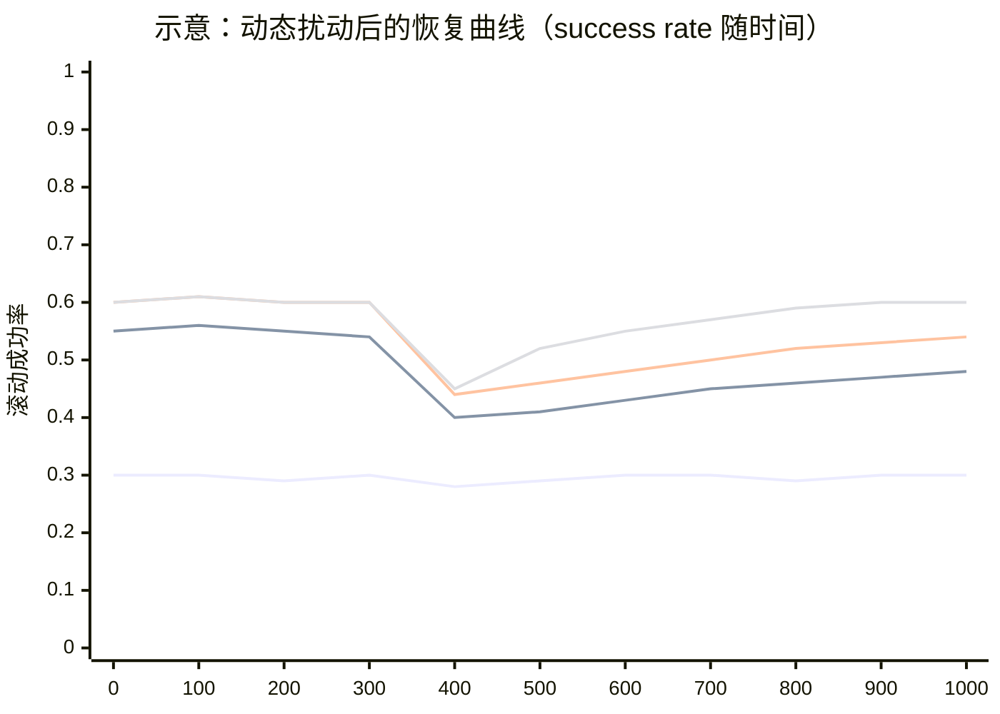

# 能力感知路由学习在动态 LLM 智能体系统中的相关工作定位与对比实验设计（NeurIPS 导向）

## 执行摘要

该扩展摘要提出“动态 worker 池下的能力感知协同调度”问题：任务族相对稳定，但可用的 LLM/工具型 worker 会因升级、替换、权限、成本与时延变化而持续漂移。核心思路是在控制器侧维护可在线更新的多维能力嵌入（适配性、成功率、token、时延、稳定性等），并将调度建模为“任务编码→能力估计→路由/轻量分解→执行→后验更新”的闭环，以多目标效用（成功–成本–时延–协同开销）驱动决策。相较既有多偏离线、静态候选或标量评分的路由/级联，本工作把“动态变化、冷启动、漂移适应速度”提升为主评测维度，具备 NeurIPS 风格的清晰问题定义与可验证方法张力。对实验上，优先建议以 GSM8K 与 HumanEval（可自动判分）做小规模快速验证，再扩展到多步信息搜索基准与更强动态扰动协议形成主结果。citeturn12view0turn12view1turn15view0turn15view1

```mermaid
flowchart LR
  A[输入任务 x_t] --> B[任务编码器: z(x_t)]
  B --> C[能力模块: 为每个worker维护多维能力嵌入 ĉ_i]
  C --> D{调度动作空间}
  D -->|直接路由| E[选择1个worker]
  D -->|少量并行| F[选择k个worker并行/投票]
  D -->|轻量分解-路由| G[生成m个子任务]
  G --> H[对子任务分别路由]
  E --> I[执行与反馈 y, token, latency]
  F --> I
  H --> I
  I --> J[判分/回报: success & cost]
  J --> K[在线更新 ĉ_i 与路由器参数]
  K --> C
```

## 摘要要点提取表

> 本表严格依据你上传的扩展摘要（/mnt/data/能力感知路由学习.md）抽取；摘要未提及者标注为“未指定”。

| 维度 | 摘要中给出的内容（抽取/归纳） |
|---|---|
| 研究问题 | 在层级式多智能体 LLM 系统中，主智能体/调度器需要在 **worker 能力不可直接观测且 worker 池动态变化**（模型家族/工具权限/成本/时延/版本变化）的条件下，对来自相对稳定任务族的任务进行路由与轻量分解决策，以最大化成功率并控制资源与协同成本。 |
| 核心方法 | 为每个 worker 维护一个可在线更新的 **多维能力嵌入** ĉ_i（适配性、成功率/正确性、token、时延、稳定性等），结合任务编码 z_x 预测任务—worker 适配与效用，并在小规模动作空间内选择：直接路由、少量并行、或轻量分解后再路由；形成闭环学习。 |
| 关键假设 | 任务分布/任务族相对稳定；worker 池非平稳（替换、漂移、权限与成本/时延变动、冷启动）；仅能通过执行反馈得到部分且滞后的观测；“轻量分解”被刻意约束为少量子任务以隔离能力估计对调度的贡献。 |
| 主要贡献 | （1）形式化“能力感知调度/路由”问题；（2）提出在线能力嵌入+层级调度闭环框架；（3）提出围绕动态 worker 池适应性的评测协议（替换/漂移/成本时延变化/冷启动），并强调适应速度、鲁棒性与效率权衡。 |
| 预期实验设置 | 在异质推理任务族上评估（数学推理、代码生成、多步信息搜索），显式构造动态 worker 池并比较静态路由、标量分数选择、随机分派、oracle 上界；指标覆盖最终成功率、token 成本、时延、适应速度与鲁棒性。 |
| 数据集 | **未指定**（仅指定任务族类型）。 |
| 训练/超参/预算 | **未指定**（仅给出多目标效用形式：成功–token–latency–coordination 的加权折中）。 |

## 代表性论文清单表

> 覆盖 2019–2024 与“多模型路由/级联、在线决策与非平稳适应、多智能体编排与工具调用、（内部）路由机制”最相关的代表性工作（≥10）。每条给出 1–2 句要点与和你 idea 的关键差异，并提供原文链接（以英文/中文原文为主，链接以代码形式展示）。

| 代表性论文（年份/ venue） | 1–2 句要点 | 与你 idea 的主要差异（方法与设定层面） | 原文链接 |
|---|---|---|---|
| RouteLLM: Learning to Route LLMs with Preference Data（2024，arXiv） | 用人类偏好数据训练路由器，在强/弱两模型间动态选择以在质量–成本折中下节省开销；并强调对更换模型对的迁移能力。citeturn12view0 | 主要是**静态候选（通常两模型）+ 离线路由训练**；不以“动态 worker 池（替换/漂移/冷启动）+ 在线能力后验更新”作为中心问题，也未显式建模多维能力画像（除成本/质量外的时延、稳定性、协同开销）。 | `https://arxiv.org/abs/2406.18665` |
| FrugalGPT: How to Use LLMs While Reducing Cost and Improving Performance（2023，arXiv） | 讨论并实现 LLM 级联/近似/提示适配等策略，学习在多个 LLM API 组合下减少推理成本并保持/提升性能。citeturn12view1 | 更偏“应用侧级联框架与成本优化”，能力刻画多为**标量质量/难度信号**；对 worker 池非平稳性与“在线维护多维能力嵌入”的适应机制强调不足。 | `https://arxiv.org/abs/2305.05176` |
| Large Language Model Cascades with Mixture of Thoughts…（2024，ICLR） | 以“弱模型答案一致性”作为难度信号，决定是否升级到强模型，并用 CoT/PoT 的混合表征改进一致性判断，实现接近强模型性能但显著降成本。citeturn17view0turn0search1 | 典型是“弱→强”的**两阶段升级**；不维护多 worker 的可解释能力后验，也不把 worker 替换/漂移作为核心评测维度。 | `https://arxiv.org/abs/2310.03094` |
| LLM-Blender（2023，ACL） | 通过 PairRanker（成对比较）对多模型候选输出排序，再用 GenFuser 融合生成更好答案；并提供 MixInstruct 促进评测。citeturn4search2turn16view3 | 属于“**先多生成再排序/融合**”的集成范式，追求输出质量上限；你的工作更关注在预算/时延约束下的**路由决策与在线适应**，而非事后融合。 | `https://aclanthology.org/2023.acl-long.792/` |
| Mixture-of-Agents（2024，arXiv） | 构建分层多智能体，每层 agent 利用前层输出作为辅助信息以迭代提升，报告多个对话评测上性能提升。citeturn13view2 | 更偏“多 agent 叠加提升上限”，通常需要更多并行与更高协同成本；你的摘要强调小动作空间与多目标效用，并把 worker 池动态变化作为核心挑战。 | `https://arxiv.org/abs/2406.04692` |
| AutoGen（2023，arXiv；后续扩展到 COLM 2024 版本） | 提供多智能体对话编排框架，支持可定制 agent、工具与人类输入，覆盖数学/代码/QA/在线决策等应用。citeturn13view0turn8search6 | 偏基础设施/编排范式，调度多依赖流程设计；你的工作主张把调度显式建模为可学习决策并面向动态 worker 池做在线能力估计。 | `https://arxiv.org/abs/2308.08155` |
| CAMEL（2023，NeurIPS） | 提出 role-playing / inception prompting 促进多 agent 自治协作，并研究多智能体社会行为。citeturn16view0turn5search2 | 聚焦协作机制与对话数据生成；未系统处理“预算/成本/时延约束下的最优调度”与“动态 worker 池在线适应”。 | `https://arxiv.org/abs/2303.17760` |
| Toolformer（2023，NeurIPS） | 让模型自监督学会“何时调用哪个 API、如何传参并利用结果”，用少量示例把工具使用能力内化到 LM 中。citeturn5search1turn16view1 | 解决的是**单模型内部的工具调用选择**；你的问题是控制器在多个外部 worker（可视为动态工具）间做分派，并维护每个 worker 的能力后验。 | `https://proceedings.neurips.cc/paper_files/paper/2023/hash/d842425e4bf79ba039352da0f658a906-Abstract-Conference.html` |
| ToolLLM / ToolBench / ToolEval（2024，ICLR） | 提出 ToolBench（大规模真实 API）、ToolEval 自动评测，并微调得到可调用大量 API 的 ToolLLaMA/ToolLLM 体系。citeturn6search4 | 关注“模型学会用工具/检索 API”与评测体系；你的工作关注“在动态 worker 池中调度谁”，可将“带工具权限的 worker”作为你评测中的关键扰动来源。 | `https://proceedings.iclr.cc/paper_files/paper/2024/hash/28e50ee5b72e90b50e7196fde8ea260e-Abstract-Conference.html` |
| ReAct（2023，ICLR） | 交替生成推理轨迹与行动（检索/交互），在 HotpotQA、ALFWorld、WebShop 等任务上提升效果并降低幻觉。citeturn17view1 | ReAct 的“行动选择”仍是单智能体内部策略；你的工作是跨 worker 的调度与能力估计，可把 ReAct 视作某类“具检索能力 worker”的实现基线。 | `https://arxiv.org/abs/2210.03629` |
| Self-Consistency（2023，ICLR） | 对同一问题采样多条推理路径并以一致性投票/边缘化选答案，显著提升多步推理准确率。citeturn16view2 | 是“同一模型的多采样集成”，可作为你“少量并行 worker/投票”动作的强基线；但它不涉及动态 worker 池与在线能力画像。 | `https://arxiv.org/abs/2203.11171` |
| Tree of Thoughts（2023，NeurIPS 版本） | 将推理解码扩展为对“thought 单元”的显式搜索（前瞻/回溯），增强需要探索的任务求解能力。citeturn14view0 | ToT 解决“推理搜索/规划”本身；你的摘要刻意把分解限制为轻量，主旨是隔离并研究能力估计对调度的贡献。 | `https://arxiv.org/abs/2305.10601` |
| NeuralUCB（2020，ICML） | 在上下文 bandit 中用神经网络表达奖励函数，并构造 UCB 进行有效探索，给出遗憾界并在基准上验证。citeturn0search2 | 提供“上下文+探索—利用”的方法学基础；你的工作需要把上下文从通用特征具体化为任务语义编码，并扩展到多维回报、成本/时延约束与动态漂移协议。 | `https://proceedings.mlr.press/v119/zhou20a.html` |
| NeuralPES（2023，arXiv） | 面向非平稳上下文 bandit，结合深度结构与探索策略以减少无效探索并提升在非平稳推荐数据上的表现。citeturn14view1 | 可直接作为你“动态 worker 池”设定下的强在线学习基线；但它不包含 LLM 调度中的分解动作结构与可解释能力画像。 | `https://arxiv.org/abs/2310.07786` |
| Switch Transformers（2022，JMLR） | 经典 MoE：通过路由选择不同专家实现稀疏激活，在大规模预训练中提升效率并处理训练不稳定/通信开销。citeturn8search3 | MoE 属于“模型内部可训练专家路由”；你的 worker 是外部黑箱/可替换实体，核心是在线能力后验与部署级约束（token/时延/权限）。 | `https://jmlr.org/papers/v23/21-0998.html` |

```mermaid
flowchart TB
  subgraph R[路由/级联：成本-质量折中]
    R1[RouteLLM] --> R0[静态候选/偏离线]
    R2[FrugalGPT] --> R0
    R3[LLM Cascades] --> R0
  end
  subgraph A[多智能体编排/协作]
    A1[AutoGen] --> A0[流程/对话模式]
    A2[CAMEL] --> A0
    A3[Mixture-of-Agents] --> A0
  end
  subgraph T[工具使用（单模型内生决策）]
    T1[Toolformer] --> T0[何时/如何调用工具]
    T2[ToolLLM/ToolBench] --> T0
    T3[ReAct] --> T0
  end
  subgraph B[在线学习/非平稳决策]
    B1[NeuralUCB] --> B0[上下文bandit]
    B2[NeuralPES] --> B0
  end
  R0 --> P[本文定位：动态worker池 + 多维能力后验嵌入 + 在线更新 + 小动作空间(路由/轻量分解)]
  A0 --> P
  T0 --> P
  B0 --> P
```

## 必要性与优势风险分析

### 必要性：你这条线补上的“缺口”应该说得更尖、更可证伪

- 现有 LLM 路由/级联多默认候选集合相对静态：RouteLLM 明确将路由定义为在强/弱 LLM 之间选择以优化成本—质量折中，并以偏好数据训练路由器；LLM Cascades 则以弱模型一致性作为难度信号决定是否升级到强模型。它们都未把“worker 替换、能力漂移、冷启动”作为中心问题，也缺少以“扰动后恢复速度/鲁棒性”为主指标的系统协议。citeturn12view0turn17view0turn0search1  
- 多智能体框架（AutoGen、CAMEL）更偏“如何编排对话/角色/团队”，但编排≠最优调度：框架通常不保证在成本、时延、权限与 worker 非平稳的真实部署约束下仍能持续选择最优 worker。citeturn13view0turn16view0  
- 工具使用工作（Toolformer、ToolLLM、ReAct）重要但问题不同：它们解决“一个模型如何学会调用工具/API”，而你要解决的是“控制器如何在多个异质、可变的 worker（可视为动态工具）之间学习调度策略，并在线形成对其能力边界的后验”。citeturn16view1turn6search4turn17view1  
- 在线学习理论给了“非平稳+探索”工具箱（NeuralUCB/NeuralPES），但缺少 LLM 调度的结构要素：任务语义编码、多目标回报（成功/成本/时延/协同）、以及“轻量分解—路由”的动作结构。你的贡献可以表述为把这些结构化要素引入非平稳在线决策并构造可复现实验协议。citeturn0search2turn14view1  

### 独特优势：需要落到“方法细节”层面讲清楚可复现的差异

- 模型结构优势：多维能力嵌入比标量评分更能表达部署中真实的效用分解（成功率/适配性 vs token/latency/稳定性），从而支持显式多目标权衡；对比 RouteLLM/级联常见的二元选择或标量难度信号，你可以宣称“我们学习的是能力后验的可组合表示，而不只是路由边界”。citeturn12view0turn17view0  
- 训练目标优势：把调度目标写成综合效用（成功–token–latency–coordination），并把学习置于闭环在线更新，天然可以评估“扰动→恢复曲线”，这在多仅报告静态准确率/偏好胜率的工作中是缺失的。citeturn12view0turn12view1  
- 数据需求优势：不需要对每个 worker 预先标注能力边界或重新训练全部 agent；只要能获得可判分反馈（success、token、latency）即可在线更新（这点非常适合你要求的“worker 冷启动与替换”场景）。citeturn14view1turn15view0  
- 计算成本优势：相较 MoA/Blender 这类需要“先多生成再融合”的集成，能力感知路由可通过少量探索与受控并行，把调用预算集中到更合适的 worker 上；在工程上更容易写出“可部署”的成本曲线。citeturn16view3turn13view2  

### 风险与局限：你需要在实验中主动“暴露并控制”的点

- 反馈判分偏差：若用 LLM-as-a-judge 会引入偏置；建议小规模验证优先使用可自动判分基准（GSM8K、HumanEval），避免评价噪声掩盖在线学习信号。citeturn15view0turn15view1  
- 探索成本与安全性：非平稳在线学习不可避免要探索，短期可能牺牲成功率或成本；需要报告探索开销与长期收益，并设置保守策略（如滑窗遗忘、预算上限）。citeturn14view1turn0search2  
- 多目标权重选择：λ（token/latency/coordination）不同会改变最优策略；必须报告权重敏感性与 Pareto 曲线，否则容易被质疑“调参而非方法”。citeturn12view0turn12view1  
- 能力表示可辨识性：如果只有“最终成败”作为监督，多维能力可能难以分解（难度 vs 能力）；需要引入更细粒度观测（比如 pass@k、失败类型、测试用例覆盖）或结构化任务编码。citeturn15view1turn16view2  

## 对比实验详细方案

> 本节把“小规模快速验证”作为首要配置，同时给出“大规模复现”档。你摘要未指定数据集/超参/预算，因此这里按“未指定→给推荐值”的原则补齐两档设置，并明确每个对比项的目的、预期与失败情形。

### 小规模快速验证优先配置

**选择基准（可自动判分，来源清晰）**

- 数学推理：GSM8K（来自《Training Verifiers to Solve Math Word Problems》；论文同时介绍了 GSM8K 数据集与验证式选择思路）。citeturn15view0  
- 代码生成：HumanEval（出自 Codex 评测论文《Evaluating Large Language Models Trained on Code》）。citeturn15view1  
- 可选多步信息搜索（仍可自动判分）：HotpotQA（自带 EM/F1 官方评测脚本；但其论文为 2018，不属于你要求的 2019–2024“相关工作论文”范围，这里仅作为基准补充）。citeturn10search2turn10search1  

**实验步骤（可执行、细到超参）**

1) **构造任务流**：从 GSM8K test 随机取 300–800 题、HumanEval 全量 164 题或抽取 80–120 题，按时间顺序拼成任务流 \(x_1,\dots,x_T\)。为模拟“任务族稳定”，保持各任务族比例固定（例如 GSM8K:HumanEval=4:1）。citeturn15view0turn15view1  
2) **构造异质 worker 池（至少 4 个 worker）**：  
   - w₁：便宜/快但弱（小模型或低价 API）。  
   - w₂：中等能力/成本。  
   - w₃：强但贵/慢（大模型或高价 API）。  
   - w₄：代码专长 worker（代码模型或“强模型+代码提示模板”）。  
   对每个 worker 记录真实 token 与 wall-clock latency。  
3) **动态扰动日程（小规模也要做，不然无法验证核心 claim）**：  
   - t=⅓T：**worker 替换**（例如将 w₂ 背后的模型替换为更强/更弱）。  
   - t=½T：**能力漂移**（更改 w₁ 的系统提示、限制上下文长度或改变工具权限；对代码可模拟“禁用函数库”提示）。  
   - t=⅔T：**冷启动**（引入新 worker w₅，初始无历史）。  
   - 全程：人工设定或真实测量 **成本与时延变化**（例如 API 价格阶跃、或为某 worker 增加延迟）。  
4) **实现你方法的最小闭环（推荐的“最简可跑版本”）**：  
   - 任务编码器：使用冻结的句向量模型得到 z(x)（不占用 LLM 调用预算）。  
   - 能力嵌入：每个 worker 一个向量 ĉ_i，维度 d_c=16（推荐），初始为 0 向量 + 先验（例如 success=0.5 的 Beta 先验映射）。  
   - 预测器：一个小 MLP \(f([z(x);ĉ_i])\rightarrow (\hat p_{succ}, \widehat{tok}, \widehat{lat})\)。  
   - 损失：成功率用二元交叉熵，token/latency 用 Huber 或 MSE；加权总损失。  
   - 在线更新：每 K=20 步从最近 W=200 条轨迹采样 batch=64 做 1–5 个梯度步；学习率 1e-3（Adam），并用遗忘因子或滑窗应对漂移（把旧样本降权）。  
   - 策略：最大化 \(\hat p_{succ}-\lambda_{tok}\widehat{tok}-\lambda_{lat}\widehat{lat}-\lambda_{coord}\widehat{coord}\)；探索用 ε-greedy（ε=0.05）或 UCB bonus（用 ensemble 的方差估计）。  
   - 轻量分解动作（可选最小实现）：先用一个“planner（可用 w₁）”生成 1 段 3–6 步计划（≤80 tokens），再把计划拼进 solver 的提示中求解；这只增加 1 次调用，符合“轻量”。  
5) **运行基线与消融（见下表）**，收集“扰动前/后”的滚动成功率与成本曲线。  
6) **统计检验**：对成功率做 paired bootstrap 得到 95% CI；对二元成败差异可加 McNemar；对 token/latency 用 Wilcoxon signed-rank（更稳健）。  

**资源（LLM 调用/模型数量）估计（小规模）**

- 模型/worker 数量：建议 4–5 个 worker + 0 个（或 1 个）planner。  
- 任务数：T≈500–1,000。  
- 平均每题调用次数：  
  - 仅路由：≈1.2–1.5 次（含探索与少量并行）。  
  - 含轻量分解：≈1.6–2.2 次（planner + solver）。  
- **总 LLM 调用量**：约 600–2,200 次。  
- **总 token 量**：建议以日志实测为准；初始可用“每次输入+输出 600–1,200 tokens”粗估，则总 token 约 0.4M–2.6M。  

**时间节点（给你团队/你个人执行的建议排期，不是承诺交付）**

- 第 1 天：搭建 GSM8K/HumanEval 下载与评测脚本；统一 prompt 模板与日志格式（记录 token/latency/输出/判分）。citeturn15view0turn15view1  
- 第 2 天：实现 3 类经典基线 + 你的最简闭环（无分解版本），跑一次静态池与一次动态池。  
- 第 3 天：补齐在线 bandit 基线（UCB/TS/NeuralUCB 风格）并做“扰动后恢复曲线”。citeturn0search2  
- 第 4 天：加入轻量分解动作（planner+solver）与关键消融；整理 CI、显著性、消融结论，形成可写进论文的图表。  

```mermaid
flowchart TB
  S0[准备数据与判分脚本<br/>GSM8K/HumanEval] --> S1[实现worker池与扰动日程]
  S1 --> S2[实现基线(随机/永远强/静态规则)]
  S2 --> S3[实现在线路由器(多维能力嵌入)]
  S3 --> S4[运行: 静态池 vs 动态池]
  S4 --> S5[指标: 成功率/token/latency/效用/恢复速度]
  S5 --> S6[统计检验: bootstrap + McNemar/Wilcoxon]
  S6 --> S7[生成主图: 扰动后恢复曲线 + 成本-质量Pareto]
```

### 对比实验详细方案表

> 表中“代表性 SOTA”优先选与“路由/级联”最贴近的 RouteLLM/FrugalGPT/LLM Cascades；经典方法覆盖部署中常见启发式；消融专门验证你摘要的三个关键点：多维嵌入、在线更新、轻量分解。citeturn12view0turn12view1turn17view0  

| 基线类别 | 具体对比项（每类≥3） | 对比目的 | 预期结果（若你方法成立） | 失败情形与诊断（写进 rebuttal 的思路） |
|---|---|---|---|---|
| 代表性 SOTA（路由/级联） | RouteLLM（路由器在强/弱模型间选择）citeturn12view0 | 检验“偏好数据离线路由”在你设定下的上限与对动态扰动的脆弱性 | 静态池接近；发生替换/漂移后恢复慢或需重训，而你方法能在线快速适应 | 若 RouteLLM 同样稳：说明扰动不够“对齐能力画像”，需要把变化做成“专长互补/权限改变/成本阶跃”，而不仅是整体强弱变化 |
| 代表性 SOTA（路由/级联） | FrugalGPT（LLM 级联/组合策略）citeturn12view1 | 对比“级联+评估器”是否已足够解决成本—质量折中 | 你方法在冷启动/漂移下更稳，并能同时优化 token 与 latency | 若 FrugalGPT 更优：你的能力嵌入/更新机制可能欠拟合；需要更强的 outcome predictor 或不确定性建模 |
| 代表性 SOTA（路由/级联） | LLM Cascades（弱模型一致性→是否升级强模型）citeturn17view0turn0search1 | 对比“难度信号”与“能力画像”哪种更关键 | 多 worker（>2）与非平稳下，你方法更优；特别是在“某 worker 专长更适配某子族任务”时 | 若 cascades 更优：你的任务可能主要受“难度”单因子支配；需加入更细粒度任务族与工具权限差异以体现能力画像价值 |
| 经典方法（启发式） | Always-Strong（永远调用最强/最贵 worker） | 给出质量上界与成本下界（通常成本最高） | 你方法接近其成功率，但 token/latency 显著更低 | 若你方法成功率明显低：探索过激或估计偏差；需要更保守策略（小 ε、预算下限） |
| 经典方法（启发式） | Static-Rule（按任务类别固定路由：数学→数学强，代码→代码强） | 对比“手工专长分配”在动态池下何时失效 | 动态扰动后规则法因失配而掉点，恢复慢；你方法能自适应重新分配 | 若规则法始终强：说明你的任务类别过易分离或扰动弱；需引入“同类别内能力差异/成本差异” |
| 经典方法（启发式） | Random / Round-robin（随机/轮询分派） | 作为弱基线，量化学习收益 | 你方法在动态阶段优势更显著 | 若差距不大：worker 能力差异不足或判分信号太噪，需提升异质性/改判分 |
| 消融/变体（验证核心贡献） | Ability-Scalar：把多维能力嵌入降为单一分数（成功率或综合效用标量） | 证明“多维表示”是必要而非装饰 | 多维显著优于标量，特别在 token/latency 权衡与专长互补任务上 | 若差异小：当前任务只需要“难度单轴”；需要加入成本/时延/权限多目标扰动才会拉开 |
| 消融/变体（验证核心贡献） | No-Update：能力不在线更新（只用固定先验） | 验证“在线后验更新”对漂移/替换/冷启动的贡献 | 动态扰动后明显更差，且恢复曲线更慢 | 若仍接近：扰动强度不足或更新机制未真正影响决策（路由器没用到 ĉ_i） |
| 消融/变体（验证核心贡献） | No-Decomp vs Light-Decomp：移除轻量分解动作，或只在高难度触发 planner+solver | 验证“轻量分解”是否提供额外增益，以及其协同开销是否可控 | 在更复杂任务（如多步 QA/困难数学）Light-Decomp 提升成功率且成本可控 | 若 No-Decomp 更好：分解质量差或协同惩罚权重需调整；可将分解限制为“一次计划”并严格控 token |

### 指标、显著性检验、数据集与两档超参/资源配置

| 项目 | 小规模快速验证（优先） | 大规模复现（NeurIPS 主结果） | 说明/理由 |
|---|---|---|---|
| 数据集（建议） | GSM8K + HumanEval（可选 HotpotQA distractor）citeturn15view0turn15view1turn10search2 | GSM8K + HumanEval + HotpotQA（或引入工具使用类基准如 ToolBench 子集）citeturn6search4turn10search1turn15view0turn15view1 | 小规模优先“自动判分”；大规模再覆盖“多步信息搜索/工具权限变化”以对齐摘要场景 |
| 主要指标 | 成功率/准确率；平均 token；平均 latency；综合效用 \(J\)；扰动后恢复速度（到达扰动前 95% 的步数） | 同左 + Pareto 前沿（质量–成本/质量–时延）；分位数鲁棒性（P10 成功率）；调用分布熵（是否过度依赖单 worker） | LLM Cascades/RouteLLM 等多强调成本-质量；你需要把“恢复速度/鲁棒性”做成主图。citeturn12view0turn17view0 |
| 显著性检验 | paired bootstrap（成功率/EM）；McNemar（成败对比）；Wilcoxon（token/latency） | 分层 bootstrap（按任务族分层）；多重比较校正（Holm-Bonferroni） | 成败是配对二元，bootstrap/McNemar更合适；成本分布偏态用 Wilcoxon 更稳健 |
| 你方法关键超参（推荐值） | d_c=16；ε=0.05；在线更新 K=20、W=200、lr=1e-3；分解触发阈值：\(\hat p_{succ}<0.6\) 时启用 planner | d_c=64；ensemble=3–5 估计不确定性；滑窗/遗忘因子 0.95；分解上限 m≤3 子任务 | 小规模追求可跑通；大规模再增强不确定性与分解策略 |
| 资源估计 | T=500–1,000；调用 600–2,200 次；token 0.4M–2.6M | T=10k–30k；平均 1.5–3 次/题；token 15M–100M（随并行与分解比例波动） | 用“调用次数/总 token”更可迁移（不依赖具体 API 价格） |
| 计算/硬件 | API 模式：无需 GPU；本地模式：1–2 张 24–80GB GPU（只要能跑 7B–14B 级 worker） | 本地多 worker：需要多卡或异步推理；或采用 API（注意记录真实 latency） | 动态池实验更接近部署；必须记录真实 wall-clock latency |



> 注：该图为**论文写作结构的示意**（你应报告“扰动点→恢复斜率/面积”），非真实实验结论。你的相关工作（如 LLM Cascades/RouteLLM）大多强调静态成本-质量，而你需要用“恢复曲线”把差异打出来。citeturn12view0turn17view0  

## Related work 定位草稿

现有 LLM 路由与级联工作主要围绕静态候选集合上的成本—质量折中：例如 RouteLLM 用偏好数据训练路由器在强/弱模型间选择，LLM Cascades 则以弱模型一致性推断难度并决定是否升级，FrugalGPT 通过级联与组合策略降低 API 成本。citeturn12view0turn12view1turn17view0 然而，这些方法通常将候选模型视为相对稳定资源，较少系统处理真实部署中普遍存在的 worker 替换、能力漂移、权限变化与冷启动，并缺少以扰动后恢复速度与鲁棒性为核心的评测协议。多智能体框架（如 AutoGen、CAMEL）提供通用编排与对话协作范式，但调度多依赖手工流程而非可学习的在线决策。citeturn13view0turn16view0 工具使用方法（Toolformer、ToolLLM、ReAct）关注单模型何时调用外部 API，却不回答在动态异质 worker 池中应调用谁。citeturn16view1turn6search4turn17view1 本文将协同调度显式表述为非平稳在线决策：维护可在线更新的多维能力后验嵌入，并在受控动作空间内联合优化成功率、token、时延与协同开销，从而在 worker 池持续变化时实现可验证的快速适应与成本效率。


## 更新后的 4-worker 池

推荐最终就用这四个：

* **anthropic/claude-haiku-4.5**：高质量通用 worker，替代原 Sonnet 4.5
* **google/gemini-2.5-flash**：长上下文 + workhorse worker
* **deepseek/deepseek-r1-0528**：强推理专长 worker
* **qwen/qwen3-235b-a22b-2507**：低成本开源通用 worker

它们在 OpenRouter 上的已核实信息如下：

* **Claude Haiku 4.5**：200K context，$1/M input，$5/M output；定位是高效、近前沿能力，支持 extended thinking。([OpenRouter][1])
* **Gemini 2.5 Flash**：1,048,576 context，$0.30/M input，$2.50/M output；强调 advanced reasoning、coding、mathematics、scientific tasks，并带 thinking 能力。([OpenRouter][2])
* **DeepSeek R1-0528**：163,840 context，$0.45/M input，$2.15/M output；OpenRouter 明确写到性能“on par with OpenAI o1”，适合复杂 reasoning。([OpenRouter][3])
* **Qwen3-235B-A22B-Instruct-2507**：262,144 context，$0.071/M input，$0.10/M output；多语、数学、代码、tool usage 都强，而且价格极低。([OpenRouter][4])

## “小规模快速验证”实验配置表

### 1) Worker 配置表

| 角色       | OpenRouter model id          | 定位                   | 建议任务类型                      | temperature | max_tokens | reasoning 设置                | 备注                       |
| -------- | ---------------------------- | -------------------- | --------------------------- | ----------: | ---------: | --------------------------- | ------------------------ |
| Worker A | `anthropic/claude-haiku-4.5` | 高质量通用 worker         | 复杂代码、综合推理、需要较稳指令遵循的样本       |         0.2 |       4096 | `reasoning.max_tokens=2048` | 作为“高质量但不离谱贵”的主强模型        |
| Worker B | `google/gemini-2.5-flash`    | 长上下文 workhorse       | 长 prompt、多文档上下文、普通数学/代码/综合题 |         0.2 |       4096 | `reasoning.effort=low`      | 默认主力 worker，控制成本         |
| Worker C | `deepseek/deepseek-r1-0528`  | reasoning specialist | 数学、逻辑、多步推理                  |         0.2 |       8192 | `reasoning.enabled=true`    | 主要给难推理样本                 |
| Worker D | `qwen/qwen3-235b-a22b-2507`  | 低成本开源通用 worker       | 普通 instruction、低风险代码、基础问答   |         0.2 |       3072 | 关闭 reasoning                | 作为 cheapest default path |

### 2) 统一实验控制参数

为保证对比公平，四个 worker 最好统一这些设置：

* **system prompt 固定**

  * 统一要求：直接解题，不要自报身份，不要输出多余解释；答案格式固定。
* **temperature 固定为 0.2**

  * 小规模验证阶段优先降低方差，不追求采样多样性。
* **top_p 固定为 0.95**
* **每题单次采样**

  * 不做 self-consistency，不做 best-of-n，否则你是在验证“采样堆算力”，不是验证路由。
* **不启用工具**

  * 第一轮只验证“worker 能力异质性 + router 是否学得到”。
* **统一最大输出长度**

  * 普通任务 `max_tokens=4096`
  * 数学/复杂推理任务允许 R1 到 `8192`
* **reasoning token 要固定口径**

  * OpenRouter 文档明确说明 reasoning tokens 按 output tokens 计费，所以必须固定 reasoning budget，否则成本不可比。([OpenRouter][5])

## 路由器在小规模验证中的最简实现

为了尽可能快验证 idea 是否有效，router 不要一开始就上复杂神经网络。建议先做一个**两阶段 router**：

### 阶段 1：人工定义 4 维任务特征

每个样本只提取以下 4 个离散特征：

* `task_type`：math / code / QA / long-context
* `difficulty`：easy / medium / hard
* `context_len_bin`：short / medium / long
* `needs_strict_instruction`：0 / 1

### 阶段 2：能力感知打分

对每个 worker 维护一个在线更新的分数向量：

* `acc_hat(task_type, difficulty)`
* `cost_hat`
* `latency_hat`
* `format_reliability_hat`

路由分数可先用最简单线性式：

[
score(w|x)=\alpha \cdot \hat{acc}(w,x)-\beta \cdot \hat{cost}(w)-\gamma \cdot \hat{latency}(w)+\delta \cdot \hat{format}(w)
]

初始建议：

* `alpha = 1.0`
* `beta = 0.15`
* `gamma = 0.05`
* `delta = 0.10`

前 40 题做探索，后续用 `epsilon-greedy`：

* `epsilon = 0.20` for first 40 samples
* `epsilon = 0.10` for later samples

这已经足够验证你的核心命题：
**router 是否能根据任务特征，逐渐把不同类型样本分到更合适的 worker 上，并在总体成本不暴涨的情况下提升准确率。** 

## 小规模验证时建议的分工预期

为了让实验更容易“学出结构”，初始先假设以下偏好：

* **数学 hard** → 优先 `deepseek/deepseek-r1-0528`
* **长上下文 / 长题干** → 优先 `google/gemini-2.5-flash`
* **复杂代码 / 严格格式遵循** → 优先 `anthropic/claude-haiku-4.5`
* **普通中低难样本** → 优先 `qwen/qwen3-235b-a22b-2507`

如果训练 1–2 天后 router 学出的偏好与这个先验接近，而且总体优于：

* random routing
* cheapest-first
* single-model best baseline

那就已经能说明 idea 是有效的。

## 建议的 3 个基线

你这轮小实验至少保留这 3 个 baseline：

1. **Random routing**
   四个 worker 随机选一个。

2. **Cost-first routing**
   永远优先 Qwen，只有超长上下文才用 Gemini。

3. **Single best worker**
   统一只用 `google/gemini-2.5-flash` 或只用 `anthropic/claude-haiku-4.5`。

你的方法只要能在**相近成本下提升准确率**，或者在**相近准确率下降低成本**，就足以支持继续做大实验。

## 一个可直接抄进代码配置文件的版本

```yaml
workers:
  - name: claude_haiku45
    model_id: anthropic/claude-haiku-4.5
    role: high_quality_generalist
    temperature: 0.2
    top_p: 0.95
    max_tokens: 4096
    reasoning:
      max_tokens: 2048

  - name: gemini_25_flash
    model_id: google/gemini-2.5-flash
    role: long_context_workhorse
    temperature: 0.2
    top_p: 0.95
    max_tokens: 4096
    reasoning:
      effort: low

  - name: deepseek_r1_0528
    model_id: deepseek/deepseek-r1-0528
    role: reasoning_specialist
    temperature: 0.2
    top_p: 0.95
    max_tokens: 8192
    reasoning:
      enabled: true

  - name: qwen3_235b_a22b_2507
    model_id: qwen/qwen3-235b-a22b-2507
    role: low_cost_generalist
    temperature: 0.2
    top_p: 0.95
    max_tokens: 3072
    reasoning:
      enabled: false
```

## 结论

这次替换后，4-worker 池会更适合“小规模快速验证”：

* 保留了**强通用 / 长上下文 / 强推理 / 低成本开源**四种清晰能力画像；
* 把最贵的 `claude-sonnet-4.5` 换成了**更便宜但仍接近前沿能力的 `claude-haiku-4.5`**；([OpenRouter][1])
* 更容易在有限预算下验证你提出的**能力感知路由学习**是否真的优于静态或启发式调度。

