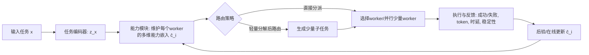
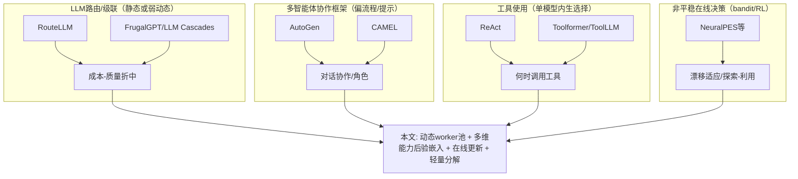
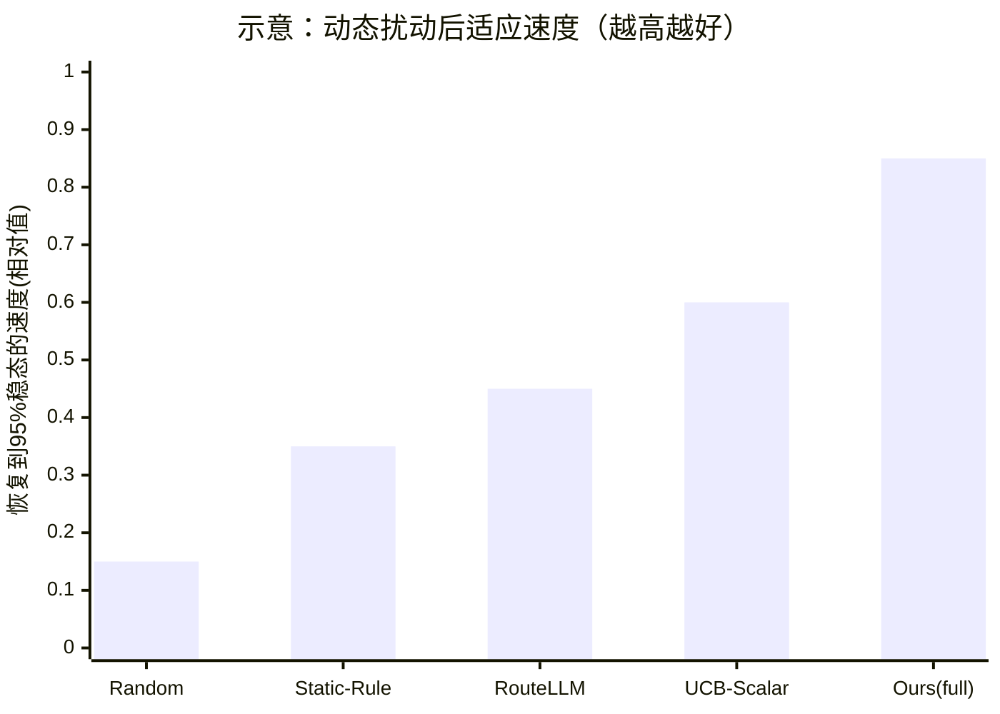

# NeurIPS 投稿导向的能力感知路由学习相关工作定位与对比实验方案调研报告

## 执行摘要

本文扩展摘要聚焦“动态多智能体 LLM 系统中的能力感知调度”：在任务族相对稳定但 worker 池持续变化（模型/工具/成本/时延/版本漂移）时，控制器需通过执行反馈在线推断各 worker 的多维能力画像，并据此进行路由及轻量分解决策。核心贡献在于：用可在线更新的多维能力嵌入替代单一分数，构成“任务编码→能力估计→路由/分解→执行→后验更新”的闭环，并提出面向 worker 替换/漂移/冷启动的评测协议。fileciteturn0file0



## 摘要要点提取表

| 维度 | 从扩展摘要中提取的内容 |
|---|---|
| 研究问题 | 动态多智能体 LLM 系统中的**能力感知调度/路由**：当任务分布相对稳定而 worker 池在模型家族、工具权限、成本、时延、版本等方面持续变化时，主智能体如何在能力部分未知条件下，学习做任务路由与轻量分解决策，以最大化成功率并控制成本/时延/协同开销。fileciteturn0file0 |
| 核心方法 | 为每个 worker 维护并在线更新一个**多维能力嵌入**（刻画任务适配性、预期正确性、token 成本、时延、稳定性等），结合任务编码 z_x 预测“任务—worker 适配度/效用”，并在小规模动作空间中选择：单 worker 路由、少量并行路由、或轻量分解后路由；形成**闭环学习**（编码→能力估计→路由→执行→后验更新）。fileciteturn0file0 |
| 关键假设 | 任务族/任务分布相对稳定；worker 池是动态的（替换、漂移、权限变化等）；可从执行获得反馈（质量/成功、token、时延等）并用于在线更新；将分解约束为“轻量、少量子任务”，以隔离能力估计对调度的影响。fileciteturn0file0 |
| 主要贡献 | （1）形式化“能力感知协同调度”问题；（2）提出在线更新的多维能力嵌入 + 路由/轻量分解框架；（3）提出围绕动态 worker 池（替换、漂移、冷启动、成本时延变化）的评测协议，关注性能、鲁棒性与效率权衡。fileciteturn0file0 |
| 预期实验设置 | 异质推理任务（数学推理、代码生成、多步信息搜索），在显式构造的动态 worker 池条件下测试；对比静态路由、基于分数的选择、随机分派、oracle 上界；评估最终性能、适应速度、成本效率以及对 worker 替换/漂移的鲁棒性。fileciteturn0file0 |
| 数据集 | **未指定**（仅给出任务族：数学推理、代码生成、多步信息搜索）。fileciteturn0file0 |
| 训练细节/超参/预算 | **未指定**（摘要中未给出能力嵌入维度、更新规则、路由器结构、学习率、调用预算等）。fileciteturn0file0 |

## 近五年代表性相关工作与差异

下表优先列出 2019–2024 期间与“多模型/多智能体路由、级联、在线决策、工具/多智能体协作”最贴近的代表性论文（≥10 篇），并用 1–2 句概述要点与与本 idea 的关键差异。

| 论文（年份/ venue） | 要点（1–2句） | 与本 idea 的主要差异 | 原文链接 |
|---|---|---|---|
| RouteLLM: Learning to Route LLMs with Preference Data（2024，arXiv/OpenReview） | 学习一个路由器在“强但贵”和“弱但便宜”的 LLM 之间动态选择，利用人类偏好数据与数据增强来训练路由器，目标是在成本与质量间取得更优折中。citeturn7search3turn0search6turn0search13 | 典型设定聚焦**两模型路由**与**离线训练**；虽讨论在更换 strong/weak 时的泛化，但并未把“worker 池持续变化、冷启动与能力漂移”作为核心评测对象，也未强调“多维能力后验”在线更新与轻量分解动作。 | `https://arxiv.org/abs/2406.18665` |
| FrugalGPT: How to Use LLMs While Reducing Cost and Improving Performance（2023–2024，TMLR/ OpenReview） | 提出在预算约束下组合多个 LLM API（包含级联等策略）以降低成本并保持/提升性能；论文给出“生成评估/路由/预算”组件化框架，并报告可大幅降低调用成本。citeturn6search4turn6search0turn6search8 | 更偏“应用侧级联与预算优化”，能力刻画通常以**标量质量分/路由判别**为主；对“动态 worker 池 + 在线能力后验更新 + 适应速度/鲁棒性”关注不足，也未突出“任务—worker 多维适配嵌入”的方法论。 | `https://lingjiaochen.com/papers/2024_FrugalGPT_TMLR.pdf` |
| Large Language Model Cascades with Mixture of Thoughts Representations for Cost-efficient Reasoning（2024，ICLR） | 研究 LLM 级联：先用弱模型，再根据弱模型输出的“一致性”等信号决定是否升级到强模型；并引入 CoT 与 PoT 的混合思维表征以做更可靠的一致性判断，从而在推理任务上显著节省成本。citeturn4search0turn4search4turn0search5 | 仍以“**二阶段升级**”为主（弱→强），主要依赖输出一致性/难度信号；不建模多 worker 的多维能力画像，也不把“worker 替换/漂移/冷启动”作为核心学习对象。 | `https://proceedings.iclr.cc/paper_files/paper/2024/hash/5de11e930c1bbfda5d4fc9d2b0924032-Abstract-Conference.html` |
| ReAct: Synergizing Reasoning and Acting in Language Models（2023，ICLR） | 提出在 prompting 中交替生成“推理轨迹”和“行动（如检索/交互）”，强调 reasoning 与 acting 的协同以提升复杂任务表现与可解释性。citeturn6search9turn1search0 | 解决的是**单智能体内部**的“何时做何种行动/工具调用”，而非在动态 worker 池中学习“调用哪个 worker”；也不涉及对 worker 能力的在线后验估计。 | `https://arxiv.org/abs/2210.03629` |
| Toolformer: Language Models Can Teach Themselves to Use Tools（2023，NeurIPS） | 通过自监督方式训练 LM 学会“何时调用哪个 API、如何传参、如何利用结果”，从而把外部工具能力融入语言建模。citeturn1search9turn6search2 | 同样是**单模型内生**工具使用学习，不是多 worker 调度；也不面向“worker 池动态变化”的在线能力画像维护问题。 | `https://arxiv.org/abs/2302.04761` |
| ToolLLM / ToolBench（2024，ICLR） | ToolLLM 提供从数据构造、训练到评测的一体化工具使用框架，并提出 ToolBench 作为大规模真实 API 工具使用数据/评测平台。citeturn9search0turn9search4turn5search4 | 强调提升模型工具调用能力与评测平台；但与本 idea 的“动态 worker 池调度”不同：它不以“在线推断不同 worker 的能力边界并路由”为目标。 | `https://proceedings.iclr.cc/paper_files/paper/2024/hash/28e50ee5b72e90b50e7196fde8ea260e-Abstract-Conference.html` |
| AutoGen: Enabling Next-Gen LLM Applications via Multi-Agent Conversation（2023，arXiv/OpenReview） | 提供多智能体对话式应用框架（conversable agents、conversation programming），支持组合多代理与多种对话模式以完成复杂任务，并做了若干应用侧实验。citeturn10search7turn9search3turn10search3 | 更偏“工程框架/编程范式”，调度/路由往往由规则与流程设计驱动；缺少围绕“能力后验 + 在线更新 + 动态 pool 评测协议”的方法贡献。 | `https://arxiv.org/abs/2308.08155` |
| CAMEL: Communicative Agents for “Mind” Exploration of LLM Society（2023，NeurIPS） | 以 role-playing 与 inception prompting 促进多智能体自治协作，研究“LLM 社会”中的协作行为与能力。citeturn1search7turn10search2turn10search6 | 更关注协作对话机制与角色设定，不以“动态 worker 池下的最优调度/在线路由学习”作为中心；也未把成本/时延/协同开销的多目标优化作为核心。 | `https://proceedings.neurips.cc/paper_files/paper/2023/hash/a3621ee907def47c1b952ade25c67698-Abstract-Conference.html` |
| Mixture-of-Agents Enhances Large Language Model Capabilities（2024，arXiv） | 提出分层的多智能体（多 LLM）组合架构：后层 agent 以更前层输出为辅助信息生成答案，在多个评测上提升质量。citeturn4search1turn2search2 | 主要是“多 agent 组合提升上限”，通常不以预算/时延为第一目标，且 agent 集合相对静态；对“在线能力估计、动态替换/漂移下的适应性路由”覆盖不足。 | `https://arxiv.org/abs/2406.04692` |
| Tree of Thoughts: Deliberate Problem Solving with LLMs（2023，arXiv） | 将推理视为对“thought”节点的搜索（如 BFS/DFS），通过生成-评估-扩展提升需要规划/搜索的任务表现。citeturn9search2turn2search3 | 强项在“推理路径搜索”，而本 idea 的重点是“在多 worker 间调度与学习其能力画像”；摘要中也刻意限制分解空间为轻量，以隔离能力估计对调度的影响。fileciteturn0file0 | `https://arxiv.org/abs/2305.10601` |
| Self-Consistency Improves Chain of Thought Reasoning（2023，ICLR） | 提出 self-consistency：采样多条 CoT 推理路径并以一致性投票/边缘化选答案，从而显著提升多步推理任务的准确率。citeturn8search11turn8search0 | 属于“同一模型/同一 worker 的多采样集成”，不解决“选择哪个 worker、如何在线学习 worker 能力后验”的调度问题；但可作为并行路由/多 worker 投票的关键基线组件。 | `https://arxiv.org/abs/2203.11171` |
| Switch Transformers（2021 arXiv / 2022 JMLR） | 经典 MoE：用门控路由在**模型内部**选择专家以实现稀疏激活、提升训练效率，并解决训练稳定性/通信成本等问题。citeturn7search0turn7search4 | 与本 idea 的“外部 black-box worker 池”本质不同：MoE 专家是可端到端训练的内部模块，而这里的 worker 可能是不同模型/工具/API、且会被替换/漂移；此外本 idea 明确把 token/时延/协同开销纳入效用并在线更新能力画像。fileciteturn0file0 | `https://jmlr.org/papers/v23/21-0998.html` |
| Non-Stationary Contextual Bandit Learning via Neural Predictive Ensemble Sampling（2023，arXiv/OpenReview） | 面向非平稳上下文 bandit，提出 NeuralPES：结合深度网络架构与探索机制，强调在非平稳环境中优先获取“持久价值”的信息并在真实数据上验证效果。citeturn4search3turn3search4 | 提供了“非平稳在线决策”的算法视角，但未结合 LLM 调度中的任务语义编码、可解释的多维成本维度与“轻量分解—路由”动作结构；可作为本 idea 理论对齐与基线实现参考。 | `https://arxiv.org/abs/2310.07786` |



## 必要性与优势风险分析

### 必要性：明确补上“动态 worker 池调度”的方法空白

- 现有 LLM 路由/级联（RouteLLM、FrugalGPT、LLM Cascades）主要围绕“在固定候选模型集合中做成本—质量折中”，常见做法是离线训练路由器或使用单一难度/一致性信号决定是否升级。它们并不以“**worker 持续替换、能力漂移、冷启动**”为核心建模对象，也缺少把“适应速度/鲁棒性”作为主指标的系统评测。citeturn7search3turn6search4turn4search4turn4search0  
- 多智能体框架（AutoGen、CAMEL）主要解决“如何组织多 agent 协作/对话流程”，但调度往往基于固定 workflow 或提示工程，不保证在资源约束（成本/时延）与环境变化（worker 更新/权限变化）下仍能持续最优。citeturn10search3turn10search2turn9search3  
- 工具使用路线（ReAct、Toolformer、ToolLLM）强调“一个模型如何学会调用外部工具/API”，但在真实部署中，**不同 worker 本身就是不同能力/成本/时延的‘工具’**，需要被持续识别其边界与优势；摘要提出的“把 worker 当作动态工具并在线推断能力”正是该缺口。citeturn6search9turn6search6turn9search0 fileciteturn0file0  

### 独特优势：方法层面的差异化贡献点

- 模型结构层面：用**多维能力嵌入**刻画“正确性/适配性/成本/时延/稳定性”，避免将复杂效用压扁为单一分数；这使路由策略可做显式多目标权衡（例如以 λ 权重控制 token、时延、协同成本）。fileciteturn0file0  
- 训练目标层面：将调度写为闭环决策过程，以“成功—成本”综合效用为目标（含 token/latency/coordination 的惩罚项），而非只优化任务正确率或偏好胜率。fileciteturn0file0  
- 数据需求层面：无需为每个 worker 重新训练或预先标注其能力边界；通过执行反馈在线更新后验，天然适配“worker 冷启动/替换”。fileciteturn0file0  
- 计算成本层面：相较 MoA/多 agent 高并发组合，摘要强调动作空间小、分解轻量，目标是在提升成功率的同时控制协调成本与调用成本。fileciteturn0file0  

### 潜在风险与局限：需要在实验中主动“拆雷”

- 反馈信号噪声：若任务难以自动判分（尤其开放域信息搜索/长答案），需要引入 judge（可能是 LLM judge）会带来噪声与偏置，从而影响在线能力后验的可靠性（建议优先选可自动判分的基准，如 GSM8K、HumanEval、HotpotQA 默认 EM/F1）。citeturn5search2turn5search3turn5search1  
- 探索代价：在线学习需要探索，短期可能牺牲成功率或成本；需要设计保守探索（如带预算的 UCB/Thompson、或安全约束）并报告“探索开销—长期收益”的曲线（可借鉴非平稳 bandit 的思路）。citeturn4search3turn3search9  
- 多维权重选择：λ（token/时延/协同成本权重）若设定不当，可能导致路由策略过度节省成本而牺牲质量，或过度追求质量导致成本失控；需要做灵敏度分析与 Pareto 曲线报告。fileciteturn0file0  
- 能力表示可辨识性：多维嵌入如果只更新“最终成败”，可能难以解耦“任务难度”与“worker 能力”；需要更细粒度观测（如步骤级结果、工具调用日志）或更强的任务编码器。fileciteturn0file0  
- 假设失配：摘要假设任务分布相对稳定；若任务分布也漂移，则“仅适应 worker”可能不够，需要扩展为双漂移（任务+worker）的鲁棒在线学习。fileciteturn0file0  

## 对比实验详细方案

### 动态 worker 池评测流程与三类扰动

为对齐摘要主张，实验必须显式模拟动态 worker 池（替换/漂移/成本变化/冷启动）。fileciteturn0file0

```mermaid
flowchart LR
  Q[从公开基准采样任务流 x_t] --> S[调度器(本文/基线)]
  S --> W[选择worker/并行/轻量分解]
  W --> R[执行: 得到答案 + token + latency]
  R --> J[自动判分或可控judge]
  J --> U[更新能力画像/路由器(仅本文/部分基线)]
  U --> S
  subgraph 评测扰动
    D1[worker替换(模型换代)] --> S
    D2[能力漂移(prompt/工具权限变)] --> S
    D3[成本/时延曲线变化] --> S
  end
```

### 对比基线与“对比目的—预期—失败情形”表

至少三类基线（SOTA 路由/级联、经典启发式、消融/变体），并额外加入 bandit 风格在线基线以贴合“动态+在线学习”的本质。

| 类别 | 具体方法（每类≥3） | 对比目的 | 预期结果（若本文有效） | 失败情形（诊断指向） |
|---|---|---|---|---|
| 代表性 SOTA（路由/级联） | RouteLLM 风格路由器（两模型 strong/weak；可扩展为 one-vs-rest 多分类路由）citeturn7search3turn0search6 | 验证“偏好/离线路由”在你设定的任务与动态扰动下的上限与脆弱性 | 静态环境下接近本文；动态替换/漂移下性能恢复慢、需要重训 | 若 RouteLLM 在漂移下仍很稳：说明动态性不够强或任务与模型差异过大/过小，需提高扰动强度或增加 worker 多样性 |
| 代表性 SOTA（路由/级联） | FrugalGPT（级联 + 质量评估/打分器 + 预算策略）citeturn6search4turn6search8turn6search0 | 验证“有 answer-scorer 的级联”是否已足够解决成本-质量折中 | 本文在“worker 替换/冷启动”下更快适应；更好平衡 token/latency/稳定性 | 若 FrugalGPT 更优：说明你的能力嵌入/更新机制不足，或需要更强的 outcome judge/verification 组件 |
| 代表性 SOTA（路由/级联） | LLM Cascades（基于一致性/难度信号的升级决策；可复现 CoT/PoT 版本）citeturn4search4turn4search0 | 对比“无需显式能力建模”的难度信号是否足够 | 在多 worker（>2）与非平稳漂移下，本文显著更稳（更低 regret/更快恢复） | 若一致性级联同样强：说明任务主要由“难度”决定，而不是“worker 特长差异”；需加入工具权限差异或专长互补的 worker |
| 经典方法（启发式/规则） | Always-Strong（永远调用最强/最贵 worker） | 提供质量上界与成本下界（通常成本最高） | 本文接近其成功率但显著更低成本/时延 | 若本文成功率显著低：说明路由决策/更新过激或探索导致损失，需要更安全策略或更好任务编码 |
| 经典方法（启发式/规则） | 静态规则路由（按任务类别：数学→数学强 worker；代码→代码强 worker；搜索→带检索工具的 worker）fileciteturn0file0 | 检验“固定专长假设”在动态 worker 池下的失效程度 | 静态阶段表现接近，但发生替换/漂移后，本文恢复更快且更鲁棒 | 若静态规则一直很强：说明你的任务类别可轻易分离、动态扰动影响不大；需引入“细粒度能力差异”（如同为数学但强项不同、成本不同） |
| 经典方法（启发式/规则） | Random / Round-robin（随机/轮询分派）fileciteturn0file0 | 提供弱基线，量化学习收益 | 本文显著超越，且优势在动态阶段更明显 | 若差距不大：说明评价信号弱、任务编码无信息或 worker 间能力差异不足 |
| Bandit/在线学习基线 | 标量 UCB / Sliding-window UCB（每个 worker 一个成功率标量 + 探索上界；滑窗应对漂移） | 对比“仅用 1D 能力分数”的在线学习是否足够 | 本文在多目标（token/latency）与细粒度任务适配上更优，且对漂移更稳 | 若 UCB 更优：能力嵌入维度可能过大/过拟合；或多维更新目标设计不当 |
| Bandit/在线学习基线 | Thompson Sampling（Beta-Bernoulli 或带上下文的 TS；可加漂移遗忘因子） | 测试贝叶斯式不确定性建模与探索策略 | 本文在“任务条件化（context）+ 多目标”下更优 | 若 TS 更优：你的任务编码与能力嵌入的交互结构可能不如贝叶斯不确定性有效，需要引入不确定性或校准机制 |
| Bandit/在线学习基线 | NeuralPES（非平稳上下文 bandit）citeturn4search3turn3search4 | 对齐“非平稳+高维上下文”的最相关在线学习基线 | 本文≈NeuralPES 或在“分解—路由结构/可解释能力向量”上更优 | 若 NeuralPES 更优：说明你的在线更新本质上仍是 naive；需要更强的非平稳探索/遗忘机制 |
| 消融/变体（本文内部） | Ability-Scalar：把多维能力嵌入降成单一分数（成功率或综合效用标量）fileciteturn0file0 | 直接验证“多维能力嵌入”的必要性 | 多维优于标量，尤其在成本/时延权衡与专长互补任务上 | 若差异小：你的任务可能只需要“难度”单轴；需加入工具权限差异与多目标约束来体现多维性价值 |
| 消融/变体（本文内部） | No-Update：能力嵌入不在线更新（只用初始/先验）fileciteturn0file0 | 验证“在线后验更新”对漂移/替换的作用 | 动态扰动后显著落后于本文完整版 | 若仍接近：说明扰动不够或能力估计对决策影响太小（路由策略可能被任务编码主导） |
| 消融/变体（本文内部） | No-Decomp：移除轻量分解动作（只做路由）；或 Always-Decomp（总分解）fileciteturn0file0 | 验证“轻量分解”是否带来额外收益以及其协调成本 | 轻量分解在信息搜索/复杂任务上提升成功率，但在简单任务上不应引入太多成本 | 若 Always-Decomp 最好：说明分解空间限制过弱或路由本身收益小；若 No-Decomp 最好：分解策略质量不足或协调成本权重需调 |

### 公开数据集建议与选择理由

摘要未指定基准，因此建议选择**可自动判分**且覆盖摘要任务族的公开基准，并在此基础上构造动态 worker 池扰动。fileciteturn0file0

- 数学推理：GSM8K（可自动判分；常用于推理路由/级联评测）citeturn5search2  
- 代码生成：HumanEval（执行式 pass@k；有官方评测工具）citeturn5search3turn5search7  
- 多步信息搜索：HotpotQA（多跳问答，可用 EM/F1 评测；也可扩展为“带检索工具的 worker”能力差异）citeturn5search1turn5search5  
- 工具使用/多步调用（可选，用于“工具权限变化”扰动）：ToolBench / ToolLLM（提供工具使用数据与评测框架）citeturn9search0turn9search4turn9search8  

### 评价指标、显著性检验与资源/超参配置表

下表给出“可执行”的统一实验配置（小规模快速验证 vs 大规模 SOTA 复现），包含指标、检验、超参要点与资源估计。若你后续补充具体 worker 列表/API 计费与长度分布，可把估计进一步数值化。

| 模块 | 小规模快速验证（建议 1–3 天可跑完） | 大规模 SOTA 复现（用于 NeurIPS 主结果） | 说明 |
|---|---|---|---|
| 任务流与规模 | 每任务族 300–800 个样本；总 1k–2.5k 任务；按时间顺序组成任务流 x_t | 每任务族 2k–8k；总 10k–30k 任务流 | 动态适应需要“时间维度”，建议用任务流而不是一次性 i.i.d. 测试 fileciteturn0file0 |
| worker 池构造 | 3–5 个 worker：能力差异显著（如：数学强/代码强/带检索工具/便宜但弱/慢但强）；每 200–500 步触发一次扰动 | 8–20 个 worker：覆盖不同模型家族/工具权限/成本时延；扰动包含替换+漂移+冷启动组合 | 扰动类型来自摘要：替换、漂移、成本/时延变化、冷启动 fileciteturn0file0 |
| 扰动日程（示例） | t=0–500 稳态；t=500 替换 1 个 worker；t=800 引入 1 个冷启动 worker；t=1000 修改成本/时延参数 | 多阶段：每 2k 步轮换 20–30% worker；随机漂移（prompt/工具权限）+ 成本阶跃变化 | 建议同时报告“单扰动”与“组合扰动”两套曲线，避免只对某类变化过拟合 |
| 主要指标 | 成功率/准确率（任务定义）；平均 token；平均时延；综合效用 J=success-λ_token·token-λ_lat·lat-λ_coord·coord；适应速度（扰动后恢复到稳态 95% 的步数）；扰动后 AUC | 同左 + Pareto 前沿（质量-成本、质量-时延）；最坏分位数（P10 成功率）；worker 利用率/调用分布熵（看是否过度依赖单一 worker） | 摘要明确强调成功率、成本效率、适应速度、鲁棒性 fileciteturn0file0 |
| 统计显著性 | 对成功率/EM：paired bootstrap（对同一任务流重采样）；对二元对比可用 McNemar；对成本/时延可用 paired t-test 或 Wilcoxon（非正态更稳） | 同左，且对多任务族做分层 bootstrap（先按任务族、再按样本） | 建议在主表给出 95% CI，并报告扰动阶段子区间的显著性 |
| 路由器/能力模块（本文）超参要点 | 能力嵌入维度 d_c=8–32；在线更新：指数遗忘/滑窗（应对漂移）；探索：ε-greedy(ε=0.05) 或 UCB 风格 bonus；分解最多 2–3 个子任务 | d_c=32–128；可引入不确定性估计（ensemble/贝叶斯头）与更精细的分解动作；探索更保守（带预算上限） | 摘要强调“多维能力嵌入 + 在线更新 + 小动作空间的分解—路由” fileciteturn0file0 |
| 基线训练设置 | RouteLLM/FrugalGPT 如需训练：用同任务族生成 strong/weak 输出并构造偏好/正确性标签；或直接复现实验脚本（若适配）citeturn7search3turn6search0turn6search4 | 在更大训练集上训练路由器；并在不同 worker 组合上做泛化测试（换 strong/weak/新增 worker）citeturn7search3 | 为公平：应给“离线可训练基线”足够训练数据，并明确其是否允许 online 更新 |
| 资源估计（以“总调用 token”计） | 目标 1k–2.5k 任务；平均每任务调用 1.2–2.0 次 worker（含探索/并行）；平均输出 300–800 token；则总输出 token 约 0.36M–4M（再加输入/上下文） | 10k–30k 任务；平均调用 1.5–3.0；输出 500–1200 token；总输出 token 约 7.5M–108M | 与其给“GPU 小时”的虚值，不如给 token/调用次数；若用开源模型本地推理，再换算到 GPU 小时。摘要的成本维度也以 token/latency 为核心 fileciteturn0file0 |



> 注：上图为**示意图**，用于解释你应在论文中报告“扰动后恢复曲线/速度”这一主张，而非真实实验结论；真实数值需按上表配置跑出。fileciteturn0file0

## Related work 定位草稿

现有 LLM 路由与级联工作主要以成本—质量折中为目标，通常在静态模型集合上离线训练路由器或依赖一致性/难度信号决定升级（如 RouteLLM、FrugalGPT、LLM Cascades），但较少将 worker 替换、能力漂移与冷启动作为核心建模与评测对象。多智能体框架强调对话式协作与角色设定（如 AutoGen、CAMEL），却往往依赖手工流程与 prompting，难以在异质资源约束下持续学习最优调度。工具使用方法解决“何时调用工具”（如 ReAct、Toolformer、ToolLLM），但并不回答“在动态 agent 池中该调用谁”。本文将协同调度置于非平稳在线决策视角，提出可在线更新的多维能力嵌入与轻量分解—路由闭环，在不重训 worker 的前提下显式优化成功率、token、时延与协同开销，并给出面向动态 worker 池的评测协议与适应性指标。citeturn7search3turn6search4turn4search4turn10search3turn10search2turn6search9turn6search6turn9search0